<p align="center">
    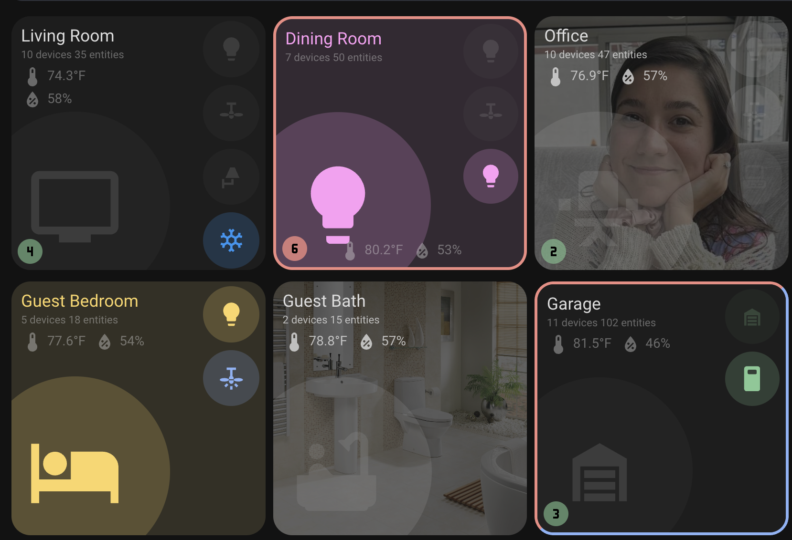
</p>
<p align="center"><h1 align="center">Room Summary Card</h1></p>
<p align="center">
  <em>Room Data at Your Fingertips</em>
</p>


[](https://github.com/hacs/integration)


<p align="center">Built with the tools and technologies:</p>
<p align="center">
  
  
  
  
  
</p>
<br>

## Overview

A custom card for Home Assistant that provides a comprehensive room overview, including climate information, device states, and problem indicators. The card displays room temperature, humidity, connected devices, and entity states in an organized grid layout.

## Features

### Climate Information

- Displays any number of sensors (temperature, humidity, or any other sensor)
  - this can be turned off with an optional flag
- Visual indicators for temperature and humidity thresholds
- Border colors indicate climate status:
  - Red: Temperature above threshold (default: 80°F)
  - Blue: Humidity above threshold (default: 60%)
- Can all be disabled with some flags


### Entity Status

- Color-coded icons indicating entity states
- Interactive icons with tap/hold actions
- Climate entity colors:
  - Auto: Green
  - Cool: Blue
  - Heat: Red
  - Dry: Yellow
  - Heat/Cool: Purple
  - Fan Only: Green
  - Off: Grey


Entity Off Color attribute. Shows lightly in a different color than the default.


### Problem Detection

- Automatically detects entities labeled as "problem" in the area based on area and labels
- Shows count of problem entities
- Color-coded indicator:
  - Red: Active problems
  - Green: No active problems


### Room Statistics

- Shows total number of devices in the room
- Shows total number of entities in the room
- Automatic entity discovery based on area

### RGB Color Support

The card now supports RGB color values directly from entities with `rgb_color` attributes. This feature works particularly well with color lights and other entities that expose RGB values.

When an entity has a valid `rgb_color` attribute (an array with three values), the card will automatically use this for coloring icons and elements. This provides a more accurate representation of colored lights and other RGB-supporting entities.

For example, a light with RGB values will show its actual color rather than a generic "on" color:

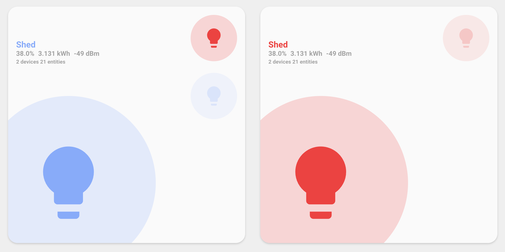
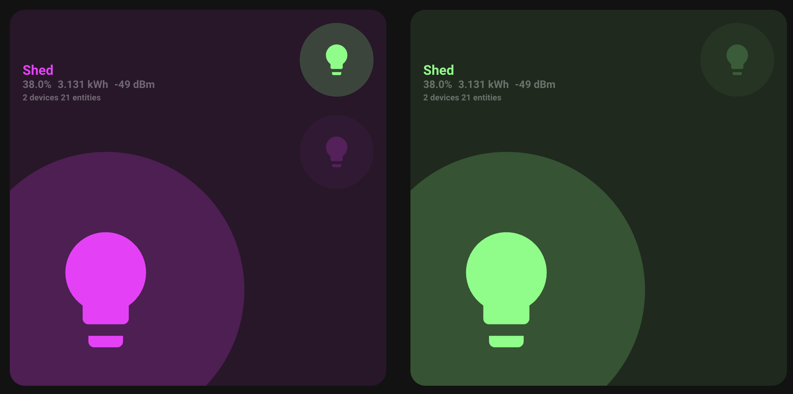

## Installation

### HACS (Recommended)

[](https://my.home-assistant.io/redirect/hacs_repository/?owner=homeassistant-extras&repository=room-summary-card&category=dashboard)

1. Open HACS in your Home Assistant instance
2. Click the menu icon in the top right and select "Custom repositories"
3. Add this repository URL and select "Dashboard" as the category
   - `https://github.com/homeassistant-extras/room-summary-card`
4. Click "Install"

### Manual Installation

1. Download the `room-summary-card.js` file from the latest release in the Releases tab.
2. Copy it to your `www/community/room-summary-card/` folder
3. Add the following to your `configuration.yaml` (or add as a resource in dashboards menu)

```yaml
lovelace:
  resources:
    - url: /local/community/room-summary-card/room-summary-card.js
      type: module
```

## Usage


Add the card to your dashboard using the UI editor or YAML:

### Card Editor

Slowly I'm enabling all the features in the card editor. Note that as things get converted to there some yaml settings may move / rename.

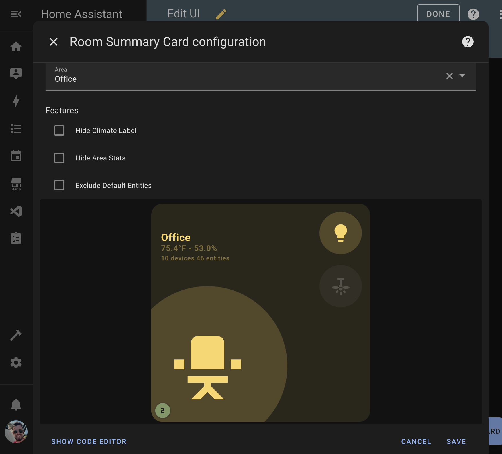

### YAML

This is the most minimal configuarion needed to get started. See below for advanced usage.

```yaml
type: custom:room-summary-card
area: living_room
```

The card will automatically:

- Display count + status for any entity labeled with "status" that is in the area
- Display fan/light entities based on area naming
- Update in real-time as entity states change
- Light up icons when entities are in 'on' state, 'True', or a positive numeric state

## Configuration Options

Most of these are optional if you setup the entities a certain way using labels and attributes. For example, see my HA configuration for my dashboard home page: [01-home.yaml](https://github.com/warmfire540/home-assistant-config-public/blob/home/ui_lovelace_minimalist/dashboard/views/01-home.yaml)

| Name      | Type             | Default                    | Description                                                       |
| --------- | ---------------- | -------------------------- | ----------------------------------------------------------------- |
| area      | string           | **Required**               | The area identifier for the room (e.g., 'living_room', 'kitchen') |
| area_name | string           | area name                  | Custom area name                                                  |
| entity    | string \| object | `light.<area>_light`       | Main entity for the room                                          |
| entities  | array            | See below                  | Additional entities to display                                    |
| sensors   | array            | See below                  | Array of sensor entities to display in the card label area        |
| navigate  | string           | area name (dash-separated) | Custom navigation path when clicking the room name / icon         |
| features  | list             | See below                  | Optional flags to toggle different features                       |

### Sensor Configuration

The card now supports configuring multiple sensors via the `sensors` array:

```yaml
sensors:
  - sensor.living_room_climate_air_temperature
  - sensor.living_room_climate_humidity
  - sensor.living_room_co2
  - sensor.living_room_pressure
```

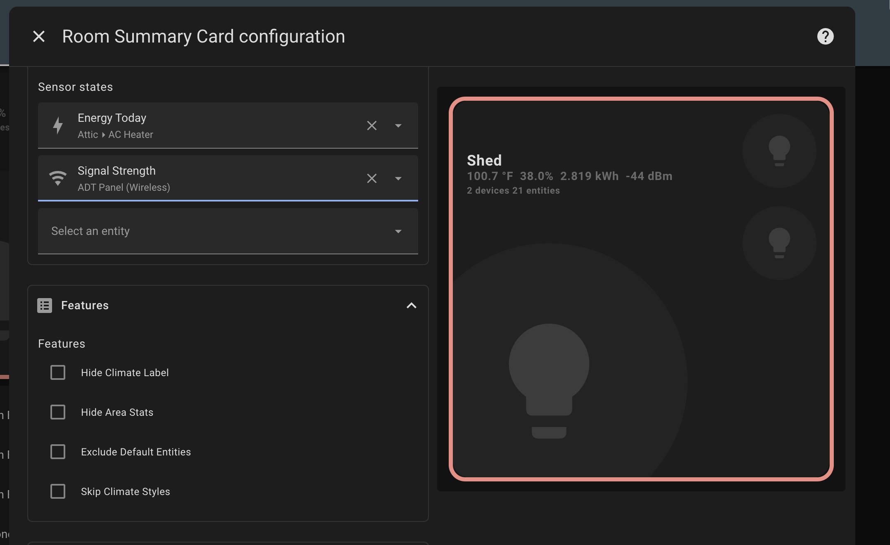

All sensors provided will be displayed in the label area of the card. These default named senses will still be looked for first: `[sensor.<area>_climate_air_temperature, sensor.<area>_climate_humidity]`

> [!NOTE]
> For backward compatibility, you can still use the legacy `temperature_sensor` and `humidity_sensor` properties, but these are deprecated and will be removed in a future version. Please migrate to using the `sensors` array.

For climate-based border styling:

- The card will automatically detect sensors with `device_class: temperature` and `device_class: humidity` attributes
- Temperature sensors with values above their threshold (default: 80°F) will trigger a red border
- Humidity sensors with values above their threshold (default: 60%) will trigger a blue border
- You can customize thresholds by adding `temperature_threshold` and `humidity_threshold` attributes to your sensors

### Feature Options

### Feature Options

| Name                     | Type | Description                                  |
| ------------------------ | ---- | -------------------------------------------- |
| hide_climate_label       | flag | Show the climate label or not                |
| hide_area_stats          | flag | Show the area statistics label or not        |
| exclude_default_entities | flag | Exclude the default light/fan entities       |
| skip_climate_styles      | flag | Disable climate-based color coding & borders |
| skip_entity_styles       | flag | Disable card styling based on main entity    |

### Default Entities

By default, the card will include (if found):

- Room light (`light.<area>_light`)
  - this is also the main entity of the card by default for coloring
- Room fan (`switch.<area>_fan`) unless `remove_fan` is true

### Entity Configuration

Entities can be specified in two ways:

1. Simple string format:

```yaml
entities:
  - light.living_room_lamp
  - switch.living_room_tv
```

2. Detailed configuration object:

```yaml
entities:
  - entity_id: light.living_room_lamp
    icon: mdi:lamp
    tap_action:
      action: toggle
    hold_action:
      action: more-info
    double_tap_action:
      action: none
```

### Entity Configuration Options

| Name              | Type   | Default                 | Description                 |
| ----------------- | ------ | ----------------------- | --------------------------- |
| entity_id         | string | **Required**            | Entity ID in Home Assistant |
| icon              | string | entity default          | Custom MDI icon             |
| tap_action        | object | `{action: "toggle"}`    | Action on single tap        |
| hold_action       | object | `{action: "more-info"}` | Action on hold              |
| double_tap_action | object | `{action: "none"}`      | Action on double tap        |

### Action Configuration

Available actions for `tap_action`, `hold_action`, and `double_tap_action`:

| Action    | Parameters      | Description                  |
| --------- | --------------- | ---------------------------- |
| toggle    | none            | Toggle entity state          |
| more-info | none            | Show more info dialog        |
| navigate  | navigation_path | Navigate to a different view |
| none      | none            | Disable the action           |

Example action configuration:

```yaml
tap_action:
  action: navigate
  navigation_path: /lovelace/living-room
```

### Entity Attributes Configuration

> [!IMPORTANT]
> These are not settings you add to the card, but instead settings you add to your entity state as attributes.

You can add attributes to entities to customize the functionality further.

| Name                  | Type   | Default         | Description                         |
| --------------------- | ------ | --------------- | ----------------------------------- |
| on_color              | string | yellow          | Color when the entity is active     |
| off_color             | string | theme off color | Color when the entity is not active |
| temperature_threshold | number | 80              | Threshold to show red border.       |
| humidity_threshold    | number | 60              | Threshold to show blue border.      |
| icon                  | string | entity default  | Custom MDI icon                     |

You can customize entity attributes several ways.

For entities you don't control, use [customizations](https://www.home-assistant.io/docs/configuration/customizing-devices/).

```yaml
customize:
  switch.garage_opener_plug:
    on_color: green
    off_color: red

  switch.water_softener_plug:
    on_color: green
    off_color: red

  sensor.garage_climate_air_temperature:
    temperature_threshold: 90

  sensor.shed_climate_air_temperature:
    temperature_threshold: 90
    humidity_threshold: 70
```

For entities you template, just set the attributes then.

```yaml
sensor:
  - name: Printer Left On
    unique_id: b4081d9f-24f3-4083-9fa6-70c30a432c26
    state: "{{ not is_state('sensor.mfc_7860dw_page_counter', 'unavailable') and (now() - states.sensor.mfc_7860dw_page_counter.last_updated) > timedelta(minutes=5) }}"
    icon: mdi:printer-alert
    attributes:
      icon: mdi:printer-alert
      on_color: blue
```

### Problem Entities

> [!IMPORTANT]
> Using this setting requires a label.

Give entities a label of "problem". These entities will be tracked and the icon will show red if any are "on" or have a positive state. It will show green otherwise. In both cases it will show the total count of tracked problem entities.

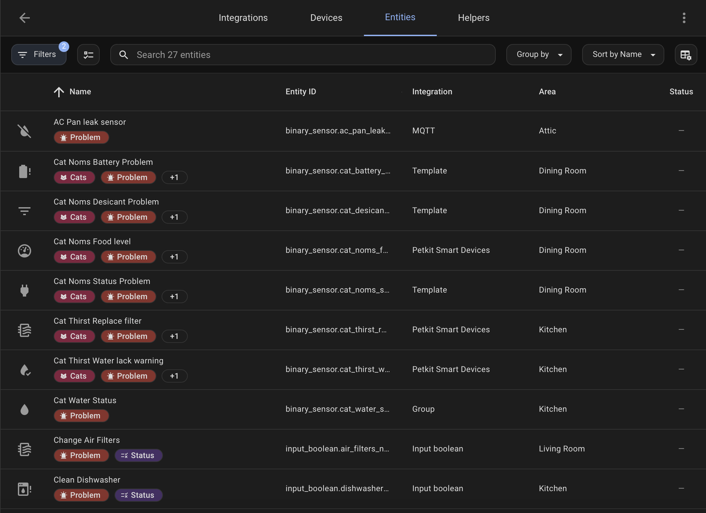

## Example Configurations

### Basic Configuration

```yaml
type: custom:room-summary-card
area: living_room
```

### Full Configuration with New Sensors Array

```yaml
type: custom:room-summary-card
area: living_room
area_name: Custom room
entity:
  entity_id: light.living_room_main
  icon: mdi:ceiling-light
  tap_action:
    action: toggle
  hold_action:
    action: more-info
entities:
  - entity_id: switch.living_room_tv
    icon: mdi:television
  - light.living_room_lamp
  - switch.living_room_fan
sensors:
  - sensor.living_room_temperature
  - sensor.living_room_humidity
  - sensor.living_room_co2
  - sensor.living_room_light_level
skip_climate_styles: false
navigate: /lovelace/living-room
features:
  - hide_area_stats
  - skip_entity_styles
```

### Legacy Configuration (Backward Compatible)

```yaml
type: custom:room-summary-card
area: living_room
entity:
  entity_id: light.living_room_main
  icon: mdi:ceiling-light
entities:
  - entity_id: switch.living_room_tv
    icon: mdi:television
  - light.living_room_lamp
  - switch.living_room_fan
temperature_sensor: sensor.living_room_temperature
humidity_sensor: sensor.living_room_humidity
navigate: /lovelace/living-room
```

### Custom Entities Only

```yaml
type: custom:room-summary-card
area: office
features:
  - exclude_default_entities
entities:
  - entity_id: light.office_desk
    icon: mdi:desk-lamp
  - entity_id: switch.office_computer
    icon: mdi:desktop-tower
  - entity_id: climate.office_ac
    icon: mdi:air-conditioner
sensors:
  - sensor.office_temperature
  - sensor.office_humidity
  - sensor.office_co2
```

Example excluding the climate entities:
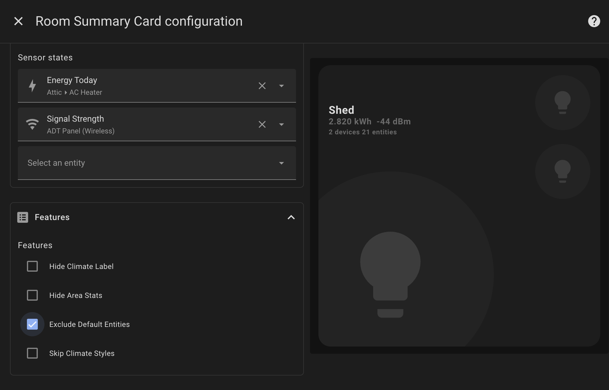

For examples, see my HA configuration for my dashboard home page: [01-home.yaml](https://github.com/warmfire540/home-assistant-config-public/blob/home/ui_lovelace_minimalist/dashboard/views/01-home.yaml)

## Themes and coloring

The card will match the following themes

- [default styling of Home Assistant](https://github.com/home-assistant/frontend/blob/master/src/resources/ha-style.ts)
- [UI Minimalist](https://ui-lovelace-minimalist.github.io/UI/)
- [iOS Themes](https://github.com/basnijholt/lovelace-ios-themes)

Default HA Example

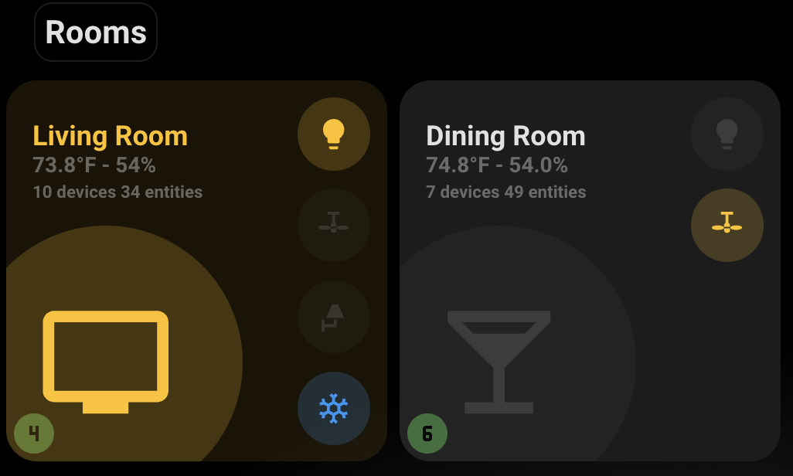
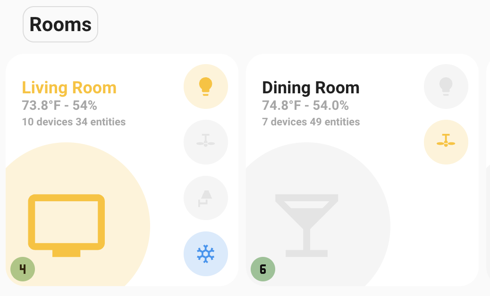

UI Minimalist Example

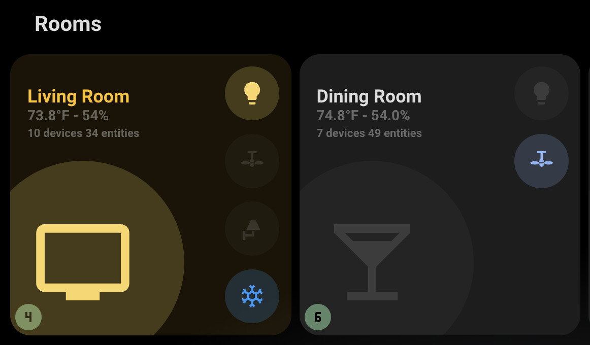
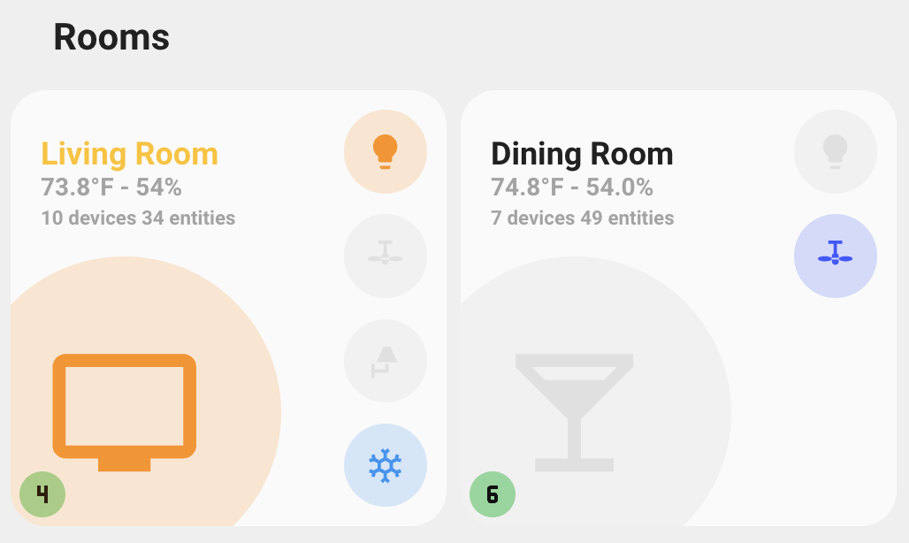

iOS Themes Example

[See Discussion](https://github.com/homeassistant-extras/room-summary-card/issues/16)

### Active Colors by Domain

Active entities will be colored based on their domain unless overriden.

| Domain Category              | Domains                                           | Active Color |
| ---------------------------- | ------------------------------------------------- | ------------ |
| **Lighting**                 | `light`, `switch_as_x`                            | Yellow       |
| **Switches & Electric**      | `switch`, `input_boolean`, `automation`, `script` | Blue         |
| **Climate & Environment**    | `climate`, `fan`                                  | Teal         |
| **Security & Safety**        | `alarm_control_panel`, `lock`                     | Red          |
| **Covers & Doors**           | `cover`, `garage_door`, `door`                    | Green        |
| **Media**                    | `media_player`                                    | Indigo       |
| **Sensors & Binary Sensors** | `binary_sensor`, `sensor`                         | Cyan         |
| **Person & Presence**        | `person`, `device_tracker`                        | Purple       |
| **Weather**                  | `weather`                                         | Orange       |
| **Vacuum**                   | `vacuum`                                          | Deep Purple  |
| **Timer & Schedule**         | `timer`, `schedule`                               | Pink         |
| **Unknown Domains**          | Any other domain                                  | Yellow       |

Each domain has a predefined color to indicate its active status.

### Available color codes

The `on_color` and `off_color` attributes support these color stylings from the theme.

- primary
- accent
- red
- pink
- purple
- deep-purple
- indigo
- blue
- light-blue
- cyan
- teal
- green
- light-green
- lime
- yellow
- amber
- orange
- deep-orange
- brown
- light-grey
- grey
- dark-grey
- blue-grey
- black
- white
- disabled

Additionally, the card now supports direct RGB colors:

- For entities with `rgb_color` attributes (like color-capable lights), the actual RGB values are used for coloring
- This provides accurate color representation without needing to manually set `on_color` values
- The card will prioritize RGB colors over theme-based colors when both are available. `on_color` and `off_color` will take precedence over RGB values.

## Project Roadmap

- [x] **`Initial design`**: create initial room card based on button-card template in UI minimialist theme.
- [x] **`Temperature`**: use uom from the device. - thanks @LiquidPT
- [x] **`Card Editor`**: ability to use the HA card editor. - thanks @elsilius
- [x] **`Test on other themes`**: make sure it works elsewhere. - thanks @tardis89, @avatar25pl
- [x] **`Flags`**: ability to disable features.
- [x] **`Multiple sensors`**: support for displaying multiple sensors in the label area. - thanks @fctruter, @LE-tarantino
- [x] **`Climate entity icon styling`**: climate entity will light up icon - thanks @murriano
- [x] **`Border styling for climate thresholds`**: border respects skip_climate_styles - thanks @LE-tarantino
- [x] **`Area name display`**: use area name instead of area ID on card - thanks @LE-tarantino
- [x] **`Navigation with room entity`**: navigate now works with room entity set - thanks @LE-tarantino
- [x] **`Card container sizing`**: card respects container - thanks @frdve
- [x] **`Border styling improvements`**: border to match HA styles better - thanks @frdve
- [x] **`Theme support for iOS theme`**: for opening issue on themes - thanks @yasalmasri
- [x] **`UI Minimalist theme integration`**: add UI minimalist theme - thanks @tardis89
- [x] **`iOS themes support`**: ios themes - thanks @avatar25pl
- [x] **`Problem entities counter`**: add problem entities counter - thanks to multiple users
- [x] **`Card RGB coloring`**: RGB lights color the card - thanks @ChristopherLMiller
- [x] **`Custom names`**: **⭐ First contributor ⭐** added `area_name` - thanks @Aulos
- [x] **`Disable card styling`**: bug fixes and new skip_entity_styles feature - thanks @benjycov

## Contributing

- **💬 [Join the Discussions](https://github.com/homeassistant-extras/room-summary-card/discussions)**: Share your insights, provide feedback, or ask questions.
- **🐛 [Report Issues](https://github.com/homeassistant-extras/room-summary-card/issues)**: Submit bugs found or log feature requests for the `room-summary-card` project.
- **💡 [Submit Pull Requests](https://github.com/homeassistant-extras/room-summary-card/blob/main/CONTRIBUTING.md)**: Review open PRs, and submit your own PRs.
- **📣 [Check out discord](https://discord.gg/NpH4Pt8Jmr)**: Need further help, have ideas, want to chat?
- **🃏 [Check out my other cards!](https://github.com/orgs/homeassistant-extras/repositories)** Maybe you have an integration that I made cards for.

<details closed>
<summary>Contributing Guidelines</summary>

1. **Fork the Repository**: Start by forking the project repository to your github account.
2. **Clone Locally**: Clone the forked repository to your local machine using a git client.
   ```sh
   git clone https://github.com/homeassistant-extras/room-summary-card
   ```
3. **Create a New Branch**: Always work on a new branch, giving it a descriptive name.
   ```sh
   git checkout -b new-feature-x
   ```
4. **Make Your Changes**: Develop and test your changes locally.
5. **Commit Your Changes**: Commit with a clear message describing your updates.
   ```sh
   git commit -m 'Implemented new feature x.'
   ```
6. **Push to github**: Push the changes to your forked repository.
   ```sh
   git push origin new-feature-x
   ```
7. **Submit a Pull Request**: Create a PR against the original project repository. Clearly describe the changes and their motivations.
8. **Review**: Once your PR is reviewed and approved, it will be merged into the main branch. Congratulations on your contribution!
</details>

## License

This project is protected under the MIT License. For more details, refer to the [LICENSE](LICENSE) file.

## Acknowledgments

- Built using [LitElement](https://lit.dev/)
- Inspired by Home Assistant's chip design
- Button-Card was a huge inspo
- Thanks to all contributors!

[](https://github.com/homeassistant-extras/room-summary-card/graphs/contributors)

[](https://ko-fi.com/N4N71AQZQG)

## Code Quality

Forgive me and my badges..

Stats

[](https://sonarcloud.io/summary/new_code?id=homeassistant-extras_room-summary-card)
[](https://sonarcloud.io/summary/new_code?id=homeassistant-extras_room-summary-card)
[](https://sonarcloud.io/summary/new_code?id=homeassistant-extras_room-summary-card)
[](https://sonarcloud.io/summary/new_code?id=homeassistant-extras_room-summary-card)
[](https://sonarcloud.io/summary/new_code?id=homeassistant-extras_room-summary-card)
[](https://sonarcloud.io/summary/new_code?id=homeassistant-extras_room-summary-card)
[](https://sonarcloud.io/summary/new_code?id=homeassistant-extras_room-summary-card)

Ratings

[](https://sonarcloud.io/summary/new_code?id=homeassistant-extras_room-summary-card)
[](https://sonarcloud.io/summary/new_code?id=homeassistant-extras_room-summary-card)
[](https://sonarcloud.io/summary/new_code?id=homeassistant-extras_room-summary-card)
[](https://sonarcloud.io/summary/new_code?id=homeassistant-extras_room-summary-card)

## Build Status

### Main

[](https://github.com/homeassistant-extras/room-summary-card/actions/workflows/push.yml)
[](https://github.com/homeassistant-extras/room-summary-card/actions/workflows/pull_request.yaml)

### Release

[](https://github.com/homeassistant-extras/room-summary-card/actions/workflows/push.yml)
[](https://github.com/homeassistant-extras/room-summary-card/actions/workflows/merge.yaml)
