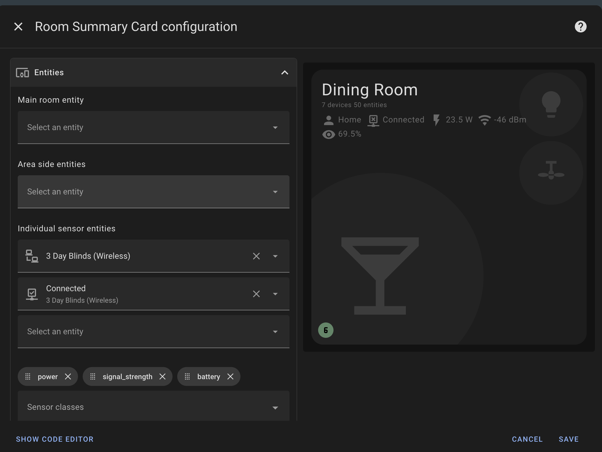

<p align="center">
    
</p>
<p align="center"><h1 align="center">Room Summary Card</h1></p>
<p align="center">
  <em>Room Data at Your Fingertips</em>
</p>


[](https://github.com/hacs/integration)


<p align="center">Built with the tools and technologies:</p>
<p align="center">
  
  
  
  
  
</p>
<br>

## Table of Contents

- [Overview](#overview)
- [Features](#features)
- [Installation](#installation)
- [Quick Start](#quick-start)
- [Documentation](#documentation)
- [Themes and Styling](#themes-and-styling)
- [Project Roadmap](#project-roadmap)
- [Contributing](#contributing)

## Overview

A custom card for Home Assistant that provides a comprehensive room overview, including climate information, device states, and problem indicators. The card displays room temperature, humidity, connected devices, and entity states in an organized flexible layout.

## Features

### Sensor Averaging

Automatically calculates and displays averaged sensor readings by device class:

- **Individual sensors**: Display specific sensors in your preferred order
- **Averaged sensors**: Show area-wide averages for device classes (temperature, humidity, etc.)
- **Smart grouping**: Groups sensors by unit of measurement for accurate averaging

### Climate Information

- Displays any number of sensors (temperature, humidity, or any other sensor)
- Visual indicators for temperature and humidity thresholds
- Border colors indicate climate status (red for temperature, blue for humidity)
- Configurable thresholds and can be disabled


### Entity Status

- Color-coded icons indicating entity states
- Interactive icons with tap/hold actions
- Climate entity colors with automatic state detection
- RGB color support for accurate light representation


### Problem Detection

- Automatically detects entities labeled as "problem" in the area
- Shows count of problem entities with color-coded indicators
- Red for active problems, green for no active problems


### Room Statistics

- Shows total number of devices and entities in the room
- Automatic entity discovery based on area assignment
- Configurable display options

### Multiple Sensor Layouts

Choose from different sensor display options:

- **Default**: In the label area alongside room statistics
- **Stacked**: Vertically stacked in the label area
- **Bottom**: At the bottom of the card for maximum visibility


### RGB Color Support

Direct RGB color values from entities with `rgb_color` attributes for accurate color representation.


## Installation

### HACS (Recommended)

[](https://my.home-assistant.io/redirect/hacs_repository/?owner=homeassistant-extras&repository=room-summary-card&category=dashboard)

1. Open HACS in your Home Assistant instance
2. Click the menu icon and select "Custom repositories"
3. Add: `https://github.com/homeassistant-extras/room-summary-card`
4. Select "Dashboard" as the category
5. Click "Install"

### Manual Installation

1. Download `room-summary-card.js` from the [latest release](https://github.com/homeassistant-extras/room-summary-card/releases)
2. Copy to `www/community/room-summary-card/`
3. Add to your `configuration.yaml`:

```yaml
lovelace:
  resources:
    - url: /local/community/room-summary-card/room-summary-card.js
      type: module
```

## Quick Start

### Minimal Configuration

```yaml
type: custom:room-summary-card
area: living_room
```

### Card Editor

Use the visual editor for easy configuration:



The card automatically discovers and displays:

- Room light and fan entities (based on area naming)
- Problem entities (labeled with "problem")
- Individual temperature and humidity sensors (via `sensors` config)
- Averaged sensor readings by device class (via `sensor_classes` config)
- Device and entity counts

## Documentation

📚 **Detailed Documentation:**

- **[Configuration Guide](docs/CONFIGURATION.md)** - Complete configuration options and examples
- **[Theming Guide](docs/THEMING.md)** - Theme support and color customization
- **[Advanced Usage](docs/ADVANCED.md)** - Advanced features and entity attributes
- **[Troubleshooting](docs/TROUBLESHOOTING.md)** - Common issues and solutions
- **[Build](docs/BUILD.md)** - Build and Code Quality statistics

## Themes and Styling

The card supports multiple themes out of the box:

- **Default Home Assistant** themes
- **[UI Minimalist](https://ui-lovelace-minimalist.github.io/UI/)** theme
- **[iOS Themes](https://github.com/basnijholt/lovelace-ios-themes)**

### Theme Examples

| Default HA                            | UI Minimalist                                    |
| ------------------------------------- | ------------------------------------------------ |
|    |    |
|  |  |

See the [Theming Guide](docs/THEMING.md) for detailed color configuration and custom theme support.

## Project Roadmap

- [x] **`Initial design`**: create initial room card based on button-card template in UI minimialist theme.
- [x] **`Temperature`**: use uom from the device. - thanks @LiquidPT
- [x] **`Card Editor`**: ability to use the HA card editor. - thanks @elsilius
- [x] **`Test on other themes`**: make sure it works elsewhere. - thanks @tardis89, @avatar25pl
- [x] **`Flags`**: ability to disable features.
- [x] **`Multiple sensors`**: support for displaying multiple sensors in the label area. - thanks @fctruter, @LE-tarantino
- [x] **`Climate entity icon styling`**: climate entity will light up icon - thanks @murriano
- [x] **`Border styling for climate thresholds`**: border respects skip_climate_styles - thanks @LE-tarantino
- [x] **`Area name display`**: use area name instead of area ID on card - thanks @LE-tarantino
- [x] **`Navigation with room entity`**: navigate now works with room entity set - thanks @LE-tarantino
- [x] **`Card container sizing`**: card respects container - thanks @frdve, @Erikkyw
- [x] **`Border styling improvements`**: border to match HA styles better - thanks @frdve
- [x] **`Theme support for iOS theme`**: for opening issue on themes - thanks @yasalmasri
- [x] **`UI Minimalist theme integration`**: add UI minimalist theme - thanks @tardis89
- [x] **`iOS themes support`**: ios themes - thanks @avatar25pl
- [x] **`Problem entities counter`**: add problem entities counter - thanks to multiple users
- [x] **`Card RGB coloring`**: RGB lights color the card - thanks @ChristopherLMiller
- [x] **`Custom names`**: **⭐ First contributor ⭐** added `area_name` - thanks @Aulos
- [x] **`Disable card styling`**: bug fixes and new skip_entity_styles feature - thanks @benjycov
- [x] **`Custom icon color integration`**: support [custom-icon-color](https://github.com/Mariusthvdb/custom-icon-color) - thanks @benjycov
- [x] **`Sensor layout options`**: flexible sensor display layouts (default, stacked, bottom) - thanks @Ltek
- [x] **`Sensor averaging by device class`**: automatic averaging like HA area card - thanks @Ltek
- [x] **`Moving away from customize.yaml`**: allowing more configuration on the card - thanks @johntdyer
- [x] **`Area, entity, and custom backgrounds`**: can setup backgrounds and customize - thanks @CalamarBicefalo

## Contributing

- **💬 [Join the Discussions](https://github.com/homeassistant-extras/room-summary-card/discussions)**: Share your insights, provide feedback, or ask questions.
- **🐛 [Report Issues](https://github.com/homeassistant-extras/room-summary-card/issues)**: Submit bugs found or log feature requests for the `room-summary-card` project.
- **💡 [Submit Pull Requests](https://github.com/homeassistant-extras/room-summary-card/blob/main/CONTRIBUTING.md)**: Review open PRs, and submit your own PRs.
- **📣 [Check out discord](https://discord.gg/NpH4Pt8Jmr)**: Need further help, have ideas, want to chat?
- **🃏 [Check out my other cards!](https://github.com/orgs/homeassistant-extras/repositories)** Maybe you have an integration that I made cards for.

## License

This project is protected under the MIT License. For more details, refer to the [LICENSE](LICENSE) file.

## Acknowledgments

- Built using [LitElement](https://lit.dev/)
- Inspired by Home Assistant's chip design
- Button-Card and Auto-Entities were a huge inspo
- Thanks to all contributors!

[](https://github.com/homeassistant-extras/room-summary-card/graphs/contributors)

[](https://ko-fi.com/N4N71AQZQG)

## Build & Code Quality

Check out **[Build Documentation](docs/BUILD.md)**!
