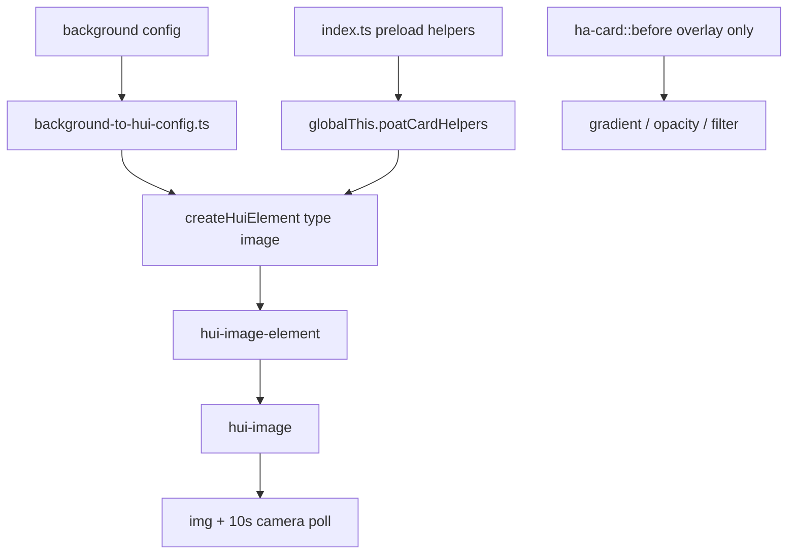

# Background Image: Delegate to HA `hui-image`

**Deliverable:** [`room-summary-card/PLAN-background-image.md`](room-summary-card/PLAN-background-image.md) (this plan, written at project root on implementation)

**Issue:** [homeassistant-extras/room-summary-card#380](https://github.com/homeassistant-extras/room-summary-card/issues/380)

---

## Problem summary

Current flow resolves a URL on **every** `hass` update, stores it in a **new Promise**, and paints via CSS `::before { background-image: url(...) }`:


This causes flicker (especially media-source and stream URLs), unnecessary WebSocket resolves, and **no camera polling** (unlike native picture/area cards).

---

## Target architecture

Delegate image lifecycle to HA's existing stack. Room-summary-card owns only:

1. **Config mapping** — `background.*` → `ImageElementConfig`
2. **Layout** — absolutely positioned background layer + existing overlay CSS
3. **Helper preload** — `resolvePoatCardHelpers(globalThis.loadCardHelpers)`



**No background renders until helpers are loaded** (user preference: maximum HA delegation, matches [device-card/src/index.ts](device-card/src/index.ts) preload pattern).

---

## What HA owns (do not reimplement)

| Concern                                       | HA component / helper                                |
| --------------------------------------------- | ---------------------------------------------------- |
| Media source resolve (once per config change) | `hui-image` `willUpdate` + `resolveMediaSource`      |
| `image.*` entity URLs                         | `computeImageUrl` inside `hui-image-element`         |
| Camera thumbnails + 10s refresh               | `hui-image` + `fetchThumbnailUrlWithCache`           |
| Live camera streams                           | `hui-image` + `ha-camera-stream`                     |
| Load/error/spinner states                     | `hui-image`                                          |
| Signed URL caching                            | `timeCacheEntityPromiseFunc` in HA camera data layer |

Reference implementations:

- [frontend/src/panels/lovelace/components/hui-image.ts](frontend/src/panels/lovelace/components/hui-image.ts)
- [frontend/src/panels/lovelace/elements/hui-image-element.ts](frontend/src/panels/lovelace/elements/hui-image-element.ts)
- [frontend/src/panels/lovelace/cards/hui-area-card.ts](frontend/src/panels/lovelace/cards/hui-area-card.ts) (picture + camera via `<hui-image>`)

---

## What we keep in room-summary-card

- **Overlay styling** — gradient (`--user-background-image-overlay`), opacity (`background-bits.ts`), state-color filters on a `::before` layer **above** the image (no `background-image` on `::before`)
- **`[image]` host attribute** — driven by **config presence**, not async URL resolution (fixes opacity-preset toggling during promise churn)
- **Modes** — `icon_background`, `hide_icon_only`, `disable`, frosted glass, alarm borders
- **Thin mapper** — domain routing only (camera vs image vs person vs static)

---

## Implementation phases

### Phase 1 — Helper preload + scaffold

**Files:**

- [room-summary-card/src/index.ts](room-summary-card/src/index.ts) — add `void resolvePoatCardHelpers(globalThis.loadCardHelpers)` (same as [device-card/src/index.ts](device-card/src/index.ts))
- **New** `room-summary-card/src/cards/components/room-background-image/room-background-image.ts`
- **New** `room-summary-card/src/theme/image/background-to-hui-config.ts`

`room-background-image` responsibilities:

- Accept `.hass`, `.config`, optional `.fitTarget` (`'card' | 'icon'`)
- Return `nothing` until `getPoatCardHelpers()` is available
- On config change: `createHuiElement(hass, mappedConfig)` with `tap_action: { action: 'none' }` (no accidental more-info)
- On hass change: update `element.hass` (persist element across renders — create on config change only, not every render)
- CSS: `position: absolute; inset: 0; z-index: 0; pointer-events: none` + `hui-image { height: 100%; object-fit: cover }`

### Phase 2 — Config mapper

**New** [`background-to-hui-config.ts`](room-summary-card/src/theme/image/background-to-hui-config.ts) — maps `Config.background` + area fallback to `ImageElementConfig`:

| Input                                       | Mapped `ImageElementConfig`                                      |
| ------------------------------------------- | ---------------------------------------------------------------- |
| `options: [disable]`                        | `undefined`                                                      |
| `image_entity` = `camera.*`                 | `{ camera_image, camera_view: 'auto' }`                          |
| `image_entity` = `image.*`                  | `{ image_entity }` (HA runs `computeImageUrl`)                   |
| `image_entity` = `person.*`                 | `{ image: entity_picture }` (only sync read; HA renders ``) |
| `background.image` (string or media object) | `{ image }`                                                      |
| area `picture` fallback                     | `{ image: area.picture }`                                        |

Priority unchanged: `image_entity` → `background.image` → `area.picture`.

**Editor:** extend [editor-schema.ts](room-summary-card/src/editor/editor-schema.ts) `image_entity` filter to include `camera` domain (docs already mention cameras; editor currently limits to `image`, `person`).

**Types (optional, in hass):** extend [hass/src/panels/lovelace/elements/types.ts](hass/src/panels/lovelace/elements/types.ts) with `ImageElementConfig` fields (`camera_image`, `image`, etc.) for typed mapper output — mirror [frontend elements/types.ts](frontend/src/panels/lovelace/elements/types.ts).

### Phase 3 — Card integration (full-card background)

**Files:**

- [room-summary-card/src/cards/card.ts](room-summary-card/src/cards/card.ts)
- [room-summary-card/src/delegates/utils/setup-card.ts](room-summary-card/src/delegates/utils/setup-card.ts)
- [room-summary-card/src/theme/render/card-styles.ts](room-summary-card/src/theme/render/card-styles.ts)
- [room-summary-card/src/theme/styles.ts](room-summary-card/src/theme/styles.ts)

Changes:

1. **Remove** `image: Promise<...>` from `RoomProperties`; remove `void image.then(...)` from `set hass`
2. **Derive** `this.image = hasBackgroundImageConfigured(config)` (boolean, sync)
3. **Render** `<room-background-image>` inside `ha-card` when not `icon_background` mode
4. **Remove** `--background-image` from `renderCardStyles`
5. **Update** `ha-card::before` styles — overlay only (gradient + opacity + filter), **no** `background-image`
6. Ensure `.grid` and overlays sit above image layer (`z-index` stacking)

### Phase 4 — Icon background mode

**Files:**

- [room-summary-card/src/cards/components/room-state-icon/room-state-icon.ts](room-summary-card/src/cards/components/room-state-icon/room-state-icon.ts)
- [room-summary-card/src/cards/components/room-state-icon/styles.ts](room-summary-card/src/cards/components/room-state-icon/styles.ts)
- [room-summary-card/src/theme/render/icon-styles.ts](room-summary-card/src/theme/render/icon-styles.ts)

When `icon_background` is set:

- Nest `<room-background-image fitTarget="icon">` inside `.icon`
- Remove inherited `--background-image` CSS-var chain for icon mode
- Preserve `hide_icon_only` behavior (icon content hidden, image visible)

### Phase 5 — Remove legacy image pipeline

**Delete or gut:**

- [room-summary-card/src/theme/image/get-pic.ts](room-summary-card/src/theme/image/get-pic.ts) — remove from hot path (delete if fully superseded)
- Async image handling in [setup-card.ts](room-summary-card/src/delegates/utils/setup-card.ts)
- Debug `console.log` calls added for #380 investigation

**Keep** `resolveMediaSource` usage only inside HA components (no direct calls from card).

### Phase 6 — Tests + docs

**Unit tests:**

- `background-to-hui-config.spec.ts` — mapper cases (camera, image, person, media source object, disable, area fallback)
- Update [test/cards/card.spec.ts](room-summary-card/test/cards/card.spec.ts), [setup-card.spec.ts](room-summary-card/test/delegates/utils/setup-card.spec.ts)
- Stub `getPoatCardHelpers` / `createHuiElement` (pattern from [whisker/test/cards/components/footer/footer-item.spec.ts](whisker/test/cards/components/footer/footer-item.spec.ts))

**E2E:**

- Update [e2e/background-opacity.spec.ts](room-summary-card/e2e/background-opacity.spec.ts) — assert `hui-image` / `img` presence instead of `::before` `background-image`
- Add flicker regression case: media-source upload background + camera entity refresh (compare with picture-entity card on same dashboard)

**Docs:**

- Update [docs/configuration/BACKGROUND-CONFIGURATION.md](room-summary-card/docs/configuration/BACKGROUND-CONFIGURATION.md)
- Note in [docs/trouble/PERFORMANCE-ISSUES.md](room-summary-card/docs/trouble/PERFORMANCE-ISSUES.md) that camera backgrounds now poll like native cards

---

## Stacking model (CSS)

```
ha-card
├── room-background-image (z-index: 0)     ← hui-image 
├── ha-card::before (z-index: 1)           ← gradient + opacity + filter only
└── .grid + overlays (z-index: 2+)         ← content
```

`icon_background` moves `room-background-image` inside `room-state-icon .icon` with same stacking inside the icon circle.

---

## Risks and mitigations

| Risk                                             | Mitigation                                                                                    |
| ------------------------------------------------ | --------------------------------------------------------------------------------------------- |
| Helpers not loaded on first paint                | Preload in `index.ts`; background layer is `nothing` until ready (card content still renders) |
| `createHuiElement` on every render               | Create element once per config change; only update `.hass` on subsequent updates              |
| Person entity not handled by `hui-image-element` | Mapper passes `entity_picture` as `image` prop (single sync read)                             |
| Shadow DOM styling of `hui-image`                | Wrapper div with explicit sizing; `fit-mode="cover"` via element property                     |
| Editor preview before Lovelace loads             | Acceptable — preview already depends on HA runtime                                            |

---

## Out of scope

- Bundling `hui-image` into the card bundle
- Vendoring `fetchThumbnailUrlWithCache` / `computeImageUrl` into `@homeassistant-extras/hass` (only needed if we abandon runtime delegation)
- `camera_view: live` config option (can be a follow-up; mapper hardcodes `auto` to match area card default)
- Per-entity grid icon `entity_picture` rendering (unchanged; separate from card background)

---

## Success criteria

1. Media-source upload backgrounds (#380) no longer flicker on unrelated `hass` updates
2. Camera `image_entity` refreshes on ~10s interval like `hui-picture-entity-card`
3. No `resolveMediaSource` WebSocket calls on every `hass` tick for static images
4. Existing e2e opacity / `icon_background` / `hide_icon_only` behavior preserved
5. `getRoomProperties` no longer returns or logs image Promises
