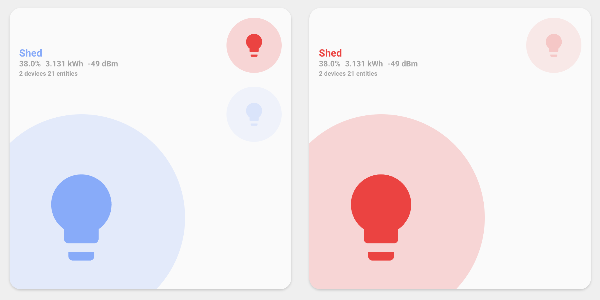

# Advanced Usage Guide

This guide covers advanced features and customization options that are actually implemented in the Room Summary Card.

## Table of Contents

- [Problem Entity Detection](#problem-entity-detection)
- [Entity Attributes Configuration](#entity-attributes-configuration)
- [Custom Icon Color Integration](#custom-icon-color-integration)
- [RGB Color Support](#rgb-color-support)
- [Climate Entity Styling](#climate-entity-styling)
- [Advanced Examples](#advanced-examples)

## Problem Entity Detection

The card can automatically detect and monitor "problem" entities in your areas using Home Assistant labels.

### Setting Up Problem Detection

1. **Label entities** with "problem" in Home Assistant:

   - Go to Settings → Areas & Labels
   - Create or edit labels
   - Add "problem" label to relevant entities

2. **Area assignment**: Problem entities must be in the same area as the card, either:
   - Directly assigned to the area
   - Belong to a device assigned to the area


### How It Works

The card automatically:

- Finds entities with "problem" label in the specified area
- Checks if any are currently active using `stateActive()` function
- Displays a counter with the total number of problem entities
- Shows green indicator if no problems are active
- Shows red indicator if any problems are active


### Example Problem Entities

Common entities to label as "problem":

- Smoke detectors (`binary_sensor.smoke_detector`)
- Water leak sensors (`binary_sensor.water_leak`)
- Door/window sensors (`binary_sensor.front_door`)
- Low battery sensors (`sensor.device_battery`)
- Offline device indicators

## Entity Attributes Configuration

You can add custom attributes to entities to control their appearance and behavior in the card.

### Color Attributes

```yaml
customize:
  switch.garage_opener_plug:
    on_color: green
    off_color: red

  switch.water_softener_plug:
    on_color: green
    off_color: red
```

### Climate Threshold Attributes

```yaml
customize:
  sensor.garage_climate_air_temperature:
    temperature_threshold: 90

  sensor.shed_climate_air_temperature:
    temperature_threshold: 90
    humidity_threshold: 70
```

### Icon Attributes

```yaml
customize:
  light.living_room:
    icon: mdi:ceiling-light
    icon_color: yellow
```

### Available Attributes

| Name                  | Type   | Default         | Description                         |
| --------------------- | ------ | --------------- | ----------------------------------- |
| on_color              | string | yellow          | Color when the entity is active     |
| off_color             | string | theme off color | Color when the entity is not active |
| temperature_threshold | number | 80              | Threshold to show red border        |
| humidity_threshold    | number | 60              | Threshold to show blue border       |
| icon                  | string | entity default  | Custom MDI icon                     |
| icon_color            | string | none            | Hex color or theme color name       |

## Custom Icon Color Integration

The card supports the [custom-icon-color integration](https://github.com/Mariusthvdb/custom-icon-color) which allows setting custom colors via the `icon_color` attribute.

### Priority Order

The card uses colors in this priority order:

1. **Hex colors** (`icon_color: "#FF5733"`) - highest priority
2. **RGB colors** (from entity's `rgb_color` attribute)
3. **Theme colors** (minimalist or HA color names)
4. **Domain colors** (default colors by entity type)

### Example Usage

```yaml
customize:
  media_player.netflix:
    icon_color: '#E50914' # Netflix red hex color
    icon: mdi:netflix

  sensor.plex:
    icon_color: '#E5A00D' # Plex gold
    icon: mdi:plex
```


### Available Color Names

**Minimalist Theme Colors**: red, green, yellow, blue, purple, grey, pink, theme

**Home Assistant Colors**: primary, accent, red, pink, purple, deep-purple, indigo, blue, light-blue, cyan, teal, green, light-green, lime, yellow, amber, orange, deep-orange, brown, light-grey, grey, dark-grey, blue-grey, black, white, disabled

## RGB Color Support

The card automatically uses RGB values from entities with `rgb_color` attributes for accurate color representation.

### How It Works

```yaml
# Entity with RGB color attribute
light.color_bulb:
  rgb_color: [255, 120, 50] # Orange color
```

The card will use this RGB value for:

- Icon coloring
- Background effects
- Theme overrides



### RGB Priority Rules

RGB colors are used when:

- Entity has valid `rgb_color` attribute (array of 3 numbers 0-255)
- No `on_color` is set for active entities
- No `off_color` is set for inactive entities
- No `icon_color` is set (which has highest priority)

## Climate Entity Styling

Climate entities receive special treatment with automatic icon and color changes based on their state.

### Climate State Icons

```yaml
# Automatic icons based on climate state:
auto: mdi:autorenew
cool: mdi:snowflake
heat: mdi:fire
dry: mdi:water
heat_cool: mdi:sun-snowflake
fan_only: mdi:fan
off: mdi:snowflake-off
```

### Climate Border Styling

The card shows colored borders based on sensor thresholds:

- **Red border**: Temperature above threshold (default: 80°F)
- **Blue border**: Humidity above threshold (default: 60%)


### Requirements for Climate Styling

1. **Device class**: Sensors must have proper `device_class`

   ```yaml
   sensor.temperature:
     device_class: temperature

   sensor.humidity:
     device_class: humidity
   ```

2. **Thresholds**: Default or custom thresholds

   ```yaml
   customize:
     sensor.temperature:
       temperature_threshold: 75 # Custom threshold
     sensor.humidity:
       humidity_threshold: 55 # Custom threshold
   ```

3. **Skip feature**: Can be disabled with feature flag
   ```yaml
   features:
     - skip_climate_styles # Disables climate borders and colors
   ```

## Advanced Examples

### Complete Room Configuration

```yaml
type: custom:room-summary-card
area: living_room
area_name: 'Living Room'
entity:
  entity_id: light.living_room_main
  icon: mdi:ceiling-light
  tap_action:
    action: toggle
  hold_action:
    action: more-info
entities:
  - entity_id: switch.living_room_tv
    icon: mdi:television
  - light.living_room_lamp
  - switch.living_room_fan
sensors:
  - sensor.living_room_temperature
  - sensor.living_room_humidity
  - sensor.living_room_co2
sensor_layout: bottom
navigate: /lovelace/living-room
features:
  - hide_area_stats
```

### Custom Colors Example

```yaml
# In customize.yaml
customize:
  light.living_room_main:
    on_color: amber
    off_color: disabled
    icon: mdi:ceiling-light

  switch.living_room_tv:
    on_color: blue
    off_color: grey
    icon_color: '#E50914' # Netflix red

  sensor.living_room_temperature:
    temperature_threshold: 75
    icon: mdi:thermometer

  sensor.living_room_humidity:
    humidity_threshold: 55
    icon: mdi:water-percent
```

### Problem Entity Setup

```yaml
# In customize.yaml - these entities should have "problem" label in UI
customize:
  binary_sensor.smoke_detector:
    icon: mdi:smoke-detector
    on_color: red

  binary_sensor.water_leak:
    icon: mdi:water-alert
    on_color: red

  sensor.low_battery_devices:
    icon: mdi:battery-alert
    on_color: orange
```

### Exclude Default Entities

```yaml
type: custom:room-summary-card
area: office
features:
  - exclude_default_entities # Don't include default light/fan
entities:
  - entity_id: light.office_desk
    icon: mdi:desk-lamp
  - entity_id: switch.office_computer
    icon: mdi:desktop-tower
  - entity_id: climate.office_ac
    icon: mdi:air-conditioner
sensors:
  - sensor.office_temperature
  - sensor.office_humidity
```

### Sensor Layout Options

```yaml
# Default layout (in label area)
type: custom:room-summary-card
area: bedroom
sensor_layout: default

# Stacked layout (vertical in label area)
type: custom:room-summary-card
area: kitchen
sensor_layout: stacked

# Bottom layout (at bottom of card)
type: custom:room-summary-card
area: living_room
sensor_layout: bottom
```


### Skip Styling Features

```yaml
type: custom:room-summary-card
area: utility_room
features:
  - skip_climate_styles # No temperature/humidity borders
  - skip_entity_styles # No card background coloring
  - hide_climate_label # No sensor display
  - hide_area_stats # No device/entity counts
  - hide_sensor_icons # No icons next to sensor values
```

## Legacy Configuration Support

The card maintains backward compatibility with older configuration formats:

### Legacy Sensor Configuration (Deprecated)

```yaml
# Old way (still works but deprecated)
temperature_sensor: sensor.custom_temperature
humidity_sensor: sensor.custom_humidity

# New way (recommended)
sensors:
  - sensor.custom_temperature
  - sensor.custom_humidity
```

### Migration Notes

- Legacy `temperature_sensor` and `humidity_sensor` properties still work
- They will be combined with the new `sensors` array if both are present
- Plan to migrate to `sensors` array as legacy properties may be removed in future versions

## Next Steps

- [Configuration Guide](CONFIGURATION.md) - Complete configuration options
- [Theming Guide](THEMING.md) - Theme support and color customization
- [Troubleshooting](TROUBLESHOOTING.md) - Common issues and solutions
