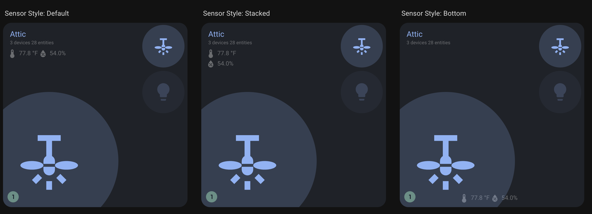

# Configuration Guide

This guide covers all configuration options for the Room Summary Card, from basic setup to advanced customization.

## Table of Contents

- [Basic Configuration](#basic-configuration)
- [Configuration Options](#configuration-options)
- [Background Configuration](#background-configuration)
- [Entity Configuration](#entity-configuration)
- [Sensor Configuration](#sensor-configuration)
- [Threshold Configuration](#threshold-configuration)
- [Feature Flags](#feature-flags)
- [Action Configuration](#action-configuration)
- [Entity Attributes](#entity-attributes)
- [Examples](#examples)

## Basic Configuration

The most minimal configuration requires only the area:

```yaml
type: custom:room-summary-card
area: living_room
```

With no additional configuration the card automatically discovers and displays:

- Room light - also the main entity for card coloring
- Room fan
- Temperature sensors
- Humidity sensors
- Area background image (if set)

See [default entities](#default-entities)

## Configuration Options

| Name           | Type             | Default                           | Description                                                       |
| -------------- | ---------------- | --------------------------------- | ----------------------------------------------------------------- |
| area           | string           | **Required**                      | The area identifier for the room (e.g., 'living_room', 'kitchen') |
| area_name      | string           | area name                         | Custom area name                                                  |
| entity         | string \| object | `light.<area>_light`              | Main entity for the room                                          |
| entities       | array            | See below                         | Additional entities to display                                    |
| sensors        | array            | See below                         | Array of sensor entities to display in the card label area        |
| navigate       | string           | area name (dash-separated)        | Custom navigation path when clicking the room name / icon         |
| background     | object           | See below                         | Background image configuration                                    |
| features       | list             | See below                         | Optional flags to toggle different features                       |
| sensor_layout  | string           | `default`                         | Layout for sensor display: `default`, `stacked`, or `bottom`      |
| sensor_classes | array            | `['temperature', 'humidity']`     | Device classes to average and display sensor readings for         |
| thresholds     | object           | `{temperature: 80, humidity: 60}` | Temperature and humidity thresholds                               |

### Default Entities

By default, the card will include (if found):

- Room light by naming convention (`light.living_room_light`)
- Room fan by naming convention (`switch.living_room_fan`)
- All temperature and humidity sensors by device class
- Problem entities (labeled with "problem")
- Area statistics
- Area background image (if picture attribute is set)

## Background Configuration

Customize the card's background appearance with images and effects:

```yaml
background:
  image: /local/images/living-room.jpg # Custom image path/URL
  image_entity: image.living_room_camera # Dynamic image from entity
  opacity: 30 # Opacity percentage (0-100)
  options:
    - disable # Disable background images entirely
```

### Background Options

| Name         | Type   | Default | Description                                                   |
| ------------ | ------ | ------- | ------------------------------------------------------------- |
| image        | string | none    | URL or path to background image                               |
| image_entity | string | none    | Entity ID for dynamic background (image, person, camera)      |
| opacity      | number | auto    | Background opacity percentage (0-100)                         |
| options      | array  | none    | Array with 'disable' to turn off background images completely |

### Background Priority

The card uses background images in this priority order:

1. **image_entity**: Dynamic image from specified entity's `entity_picture`
2. **image**: Custom image URL or path
3. **area picture**: Area's picture attribute (automatic fallback)

### Background Examples

#### Custom Background Image

```yaml
type: custom:room-summary-card
area: living_room
background:
  image: /local/images/living-room.jpg
  opacity: 25
```

#### Dynamic Background from Person Entity

```yaml
type: custom:room-summary-card
area: bedroom
background:
  image_entity: person.john
  opacity: 40
```

#### Using Camera Feed as Background

```yaml
type: custom:room-summary-card
area: garage
background:
  image_entity: camera.garage_cam
  opacity: 20
```

#### Disable Background Images

```yaml
type: custom:room-summary-card
area: office
background:
  options:
    - disable
```

## Entity Configuration

Entities can be specified in two ways:

### 1. Simple String Format

```yaml
entities:
  - light.living_room_lamp
  - switch.living_room_tv
```

### 2. Detailed Object Format

```yaml
entities:
  - entity_id: light.living_room_lamp
    icon: mdi:lamp
    tap_action:
      action: toggle
    hold_action:
      action: more-info
    double_tap_action:
      action: none
```

### Entity Configuration Options

| Name              | Type   | Default                 | Description                 |
| ----------------- | ------ | ----------------------- | --------------------------- |
| entity_id         | string | **Required**            | Entity ID in Home Assistant |
| icon              | string | entity default          | Custom MDI icon             |
| tap_action        | object | `{action: "toggle"}`    | Action on single tap        |
| hold_action       | object | `{action: "more-info"}` | Action on hold              |
| double_tap_action | object | `{action: "none"}`      | Action on double tap        |

## Sensor Configuration

The card supports two types of sensor display:

### Individual Sensors (`sensors`)

Display specific sensor entities in your preferred order:

```yaml
sensors:
  - sensor.living_room_temperature_main # Specific sensor
  - sensor.living_room_humidity_main # Specific sensor
  - sensor.living_room_co2 # Additional sensor
```

### Averaged Sensors (`sensor_classes`)

Display averaged readings for device classes across the area:

```yaml
sensor_classes:
  - temperature # Average of all temperature sensors
  - humidity # Average of all humidity sensors
  - pressure # Average of all pressure sensors
```

### Combined Configuration

You can use both together - individual sensors display first, then averages:

```yaml
sensors:
  - sensor.living_room_co2 # Shown first
sensor_classes:
  - temperature # Averaged, shown after individual
  - humidity # Averaged, shown after individual
```

### How It Works

The card automatically:

1. Finds all sensors in the area with the specified device classes
2. Groups them by unit of measurement (°F, °C, %, etc.)
3. Calculates averages for each group
4. Displays the averaged values

### Default Behavior

```yaml
# Default configuration (automatic)
sensor_classes:
  - temperature
  - humidity
```

### Custom Device Classes

```yaml
# Custom sensor classes
sensor_classes:
  - temperature
  - humidity
  - pressure
  - illuminance
  - co2
```

**Reference**: This uses similar logic as [Home Assistant's area card](https://www.home-assistant.io/dashboards/area).

### Display Priority

Sensors are displayed in this order:

1. **Individual sensors** (from `sensors` config) - in specified order
2. **Averaged sensors** (from `sensor_classes`) - grouped by device class

### Relationship with Individual Sensors

- If using `sensor_classes`, you don't need to manually include those entities in `sensors`
- Individual sensors in `sensors` will always display first
- Averaged sensors appear after individual sensors

### Sensor Layout Options

- **`default`**: Displays sensors in the label area alongside room statistics
- **`stacked`**: Displays sensors vertically stacked in the label area
- **`bottom`**: Displays sensors at the bottom of the card for maximum visibility



### Legacy Sensor Configuration (Deprecated)

For backward compatibility, you can still use:

```yaml
temperature_sensor: sensor.living_room_temperature
humidity_sensor: sensor.living_room_humidity
```

> **Note:** Please migrate to the `sensors` array as these legacy properties will be removed in a future version.

## Threshold Configuration

Configure climate-based border styling thresholds:

```yaml
thresholds:
  temperature: 75 # Temperature threshold in current unit
  humidity: 55 # Humidity threshold as percentage
```

**How It Works**:

- Temperature sensors with values above the threshold trigger red borders
- Humidity sensors with values above the threshold trigger blue borders
- Thresholds respect the current unit of measurement (°F, °C, %)
- Can be disabled with the `skip_climate_styles` feature flag

**Examples**:

```yaml
# Celsius threshold
thresholds:
  temperature: 24  # 24°C

# Fahrenheit threshold
thresholds:
  temperature: 75  # 75°F

# Custom humidity threshold
thresholds:
  humidity: 50  # 50%

# Both thresholds
thresholds:
  temperature: 78
  humidity: 65
```

**Default values**: 80°F (26.7°C) for temperature, 60% for humidity

## Feature Flags

Use feature flags to customize card behavior:

```yaml
features:
  - hide_climate_label
  - hide_area_stats
  - hide_room_icon
  - hide_sensor_icons
  - exclude_default_entities
  - skip_climate_styles
  - skip_entity_styles
```

| Feature                  | Description                                          |
| ------------------------ | ---------------------------------------------------- |
| hide_climate_label       | Hide the climate/sensor information                  |
| hide_area_stats          | Hide the area statistics (device/entity counts)      |
| hide_room_icon           | Hide the room icon (for cleaner layouts)             |
| hide_sensor_icons        | Hide the icons next to sensor values                 |
| exclude_default_entities | Don't include default light/fan entities             |
| skip_climate_styles      | Disable climate-based color coding & borders         |
| skip_entity_styles       | Disable card background styling based on main entity |

## Action Configuration

Available actions for `tap_action`, `hold_action`, and `double_tap_action`:

| Action    | Parameters      | Description                  |
| --------- | --------------- | ---------------------------- |
| toggle    | none            | Toggle entity state          |
| more-info | none            | Show more info dialog        |
| navigate  | navigation_path | Navigate to a different view |
| none      | none            | Disable the action           |

### Action Examples

```yaml
tap_action:
  action: navigate
  navigation_path: /lovelace/living-room

hold_action:
  action: more-info

double_tap_action:
  action: none
```

## Entity Attributes

These attributes can be added to your entities to customize functionality:

| Name       | Type   | Default         | Description                         |
| ---------- | ------ | --------------- | ----------------------------------- |
| on_color   | string | yellow          | Color when the entity is active     |
| off_color  | string | theme off color | Color when the entity is not active |
| icon       | string | entity default  | Custom MDI icon                     |
| icon_color | string | none            | Hex color or theme color name       |

See [Advanced Docs](ADVANCED.md) for more examples on attributes.

### Setting Entity Attributes

#### Using Customizations

```yaml
customize:
  switch.garage_opener_plug:
    on_color: green
    off_color: red
```

#### In Template Sensors

```yaml
sensor:
  - name: Printer Status
    state: "{{ not is_state('sensor.printer', 'unavailable') }}"
    icon: mdi:printer-alert
    attributes:
      on_color: blue
      off_color: grey
```

## Examples

### Basic Room

```yaml
type: custom:room-summary-card
area: living_room
```

### Custom Area Name

```yaml
type: custom:room-summary-card
area: living_room
area_name: 'Family Room'
```

### With Background Image

```yaml
type: custom:room-summary-card
area: living_room
background:
  image: /local/images/living-room.jpg
  opacity: 30
```

### With Dynamic Background

```yaml
type: custom:room-summary-card
area: bedroom
background:
  image_entity: person.john
  opacity: 40
```

### With Custom Entity

```yaml
type: custom:room-summary-card
area: living_room
entity:
  entity_id: light.living_room_main
  icon: mdi:ceiling-light
  tap_action:
    action: toggle
```

### Multiple Sensors with Bottom Layout

```yaml
type: custom:room-summary-card
area: living_room
sensors:
  - sensor.living_room_temperature
  - sensor.living_room_humidity
  - sensor.living_room_co2
  - sensor.living_room_light_level
sensor_layout: bottom
```

### With Custom Thresholds

```yaml
type: custom:room-summary-card
area: garage
thresholds:
  temperature: 85 # Red border above 85°F
  humidity: 70 # Blue border above 70%
```

### Exclude Default Entities

```yaml
type: custom:room-summary-card
area: office
features:
  - exclude_default_entities
entities:
  - entity_id: light.office_desk
    icon: mdi:desk-lamp
  - entity_id: switch.office_computer
    icon: mdi:desktop-tower
```

### Hide Room Icon

```yaml
type: custom:room-summary-card
area: bathroom
features:
  - hide_room_icon
background:
  image: /local/images/bathroom.jpg
  opacity: 35
```

### Full Configuration Example

```yaml
type: custom:room-summary-card
area: living_room
area_name: 'Living Room'
entity:
  entity_id: light.living_room_main
  icon: mdi:ceiling-light
  tap_action:
    action: toggle
  hold_action:
    action: more-info
entities:
  - entity_id: switch.living_room_tv
    icon: mdi:television
  - light.living_room_lamp
  - switch.living_room_fan
sensors:
  - sensor.living_room_temperature
  - sensor.living_room_humidity
  - sensor.living_room_co2
sensor_layout: bottom
background:
  image: /local/images/living-room.jpg
  opacity: 25
thresholds:
  temperature: 75
  humidity: 55
navigate: /lovelace/living-room
features:
  - hide_area_stats
  - hide_sensor_icons
```

### Problem Entities Setup

To use problem detection, label entities with "problem":

1. In Home Assistant, go to Settings → Areas & Labels
2. Create or edit labels
3. Add "problem" label to relevant entities
4. The card will automatically detect and count them


### Climate Thresholds

For climate-based border styling:

- Temperature sensors with `device_class: temperature` and values above threshold trigger red borders
- Humidity sensors with `device_class: humidity` and values above threshold trigger blue borders
- Configure thresholds in the card configuration:

```yaml
type: custom:room-summary-card
area: living_room
thresholds:
  temperature: 75 # Custom temperature threshold
  humidity: 55 # Custom humidity threshold
```

## Setting Up Area Pictures

To use automatic background images from areas:

1. Go to Settings → Areas & Labels in Home Assistant
2. Click on your area
3. Click "Edit"
4. Upload a picture in the "Picture" field
5. Save - the card will automatically use this as the background

## Next Steps

- [Theming Guide](THEMING.md) - Learn about theme support and color customization
- [Advanced Usage](ADVANCED.md) - Explore advanced features and integrations
- [Troubleshooting](TROUBLESHOOTING.md) - Common issues and solutions
