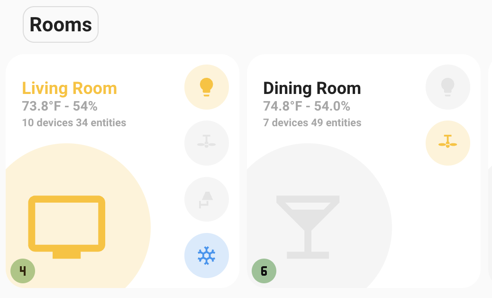
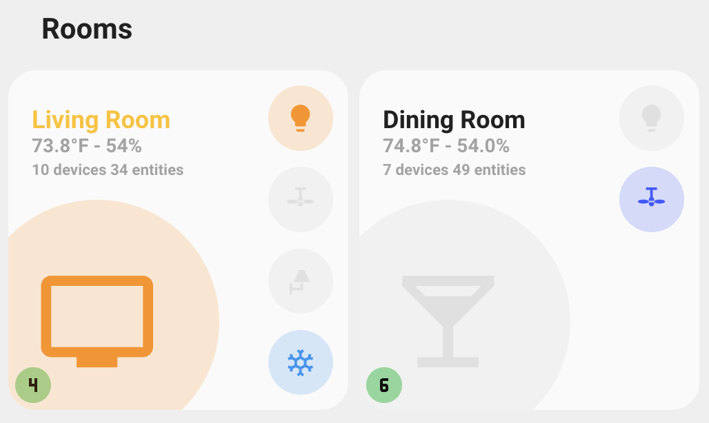
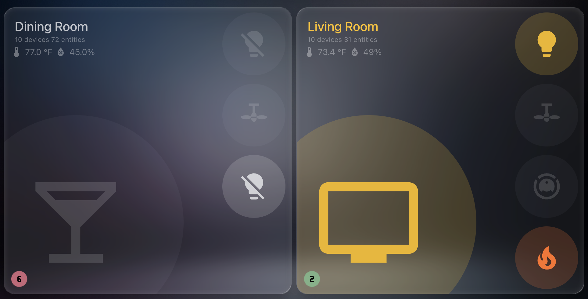
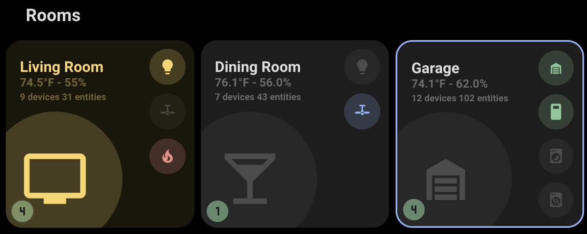
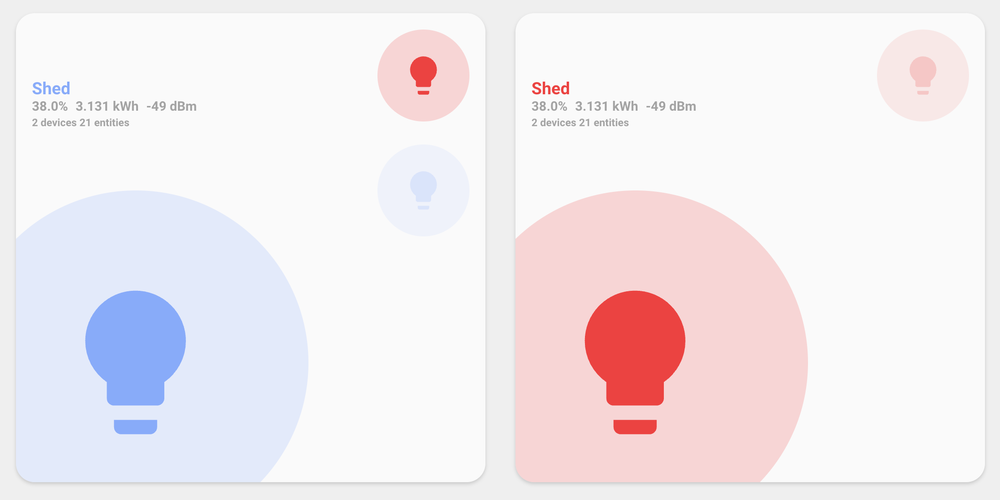
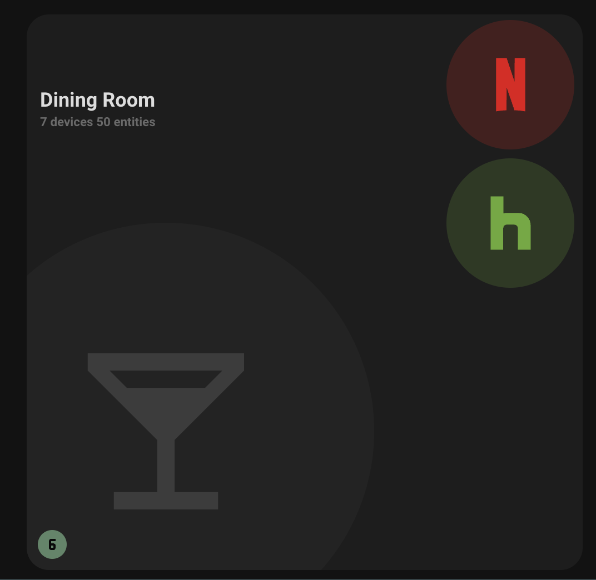
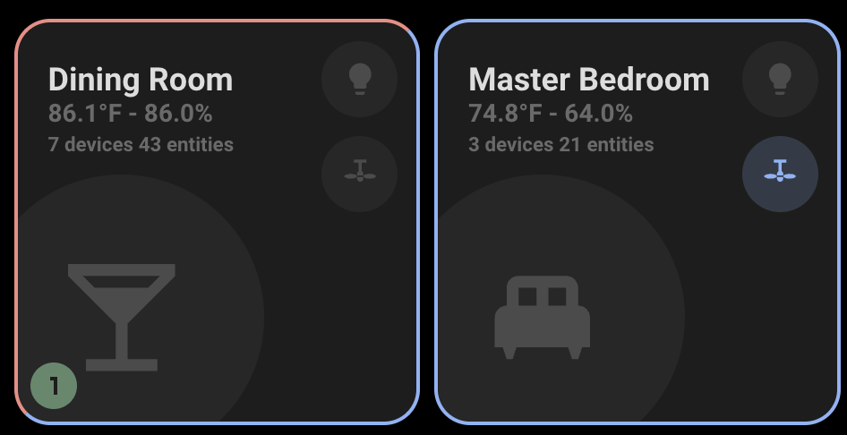
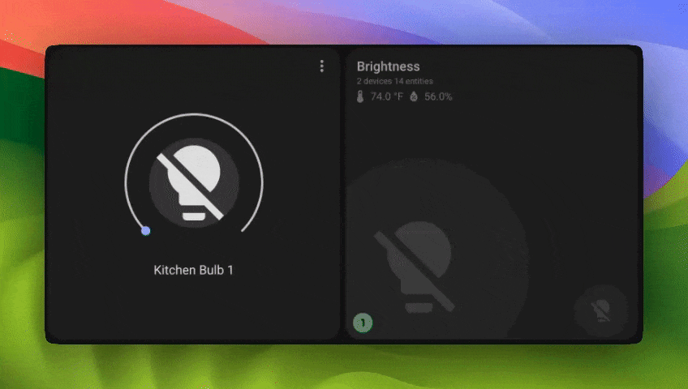

# Theming Guide

The Room Summary Card supports multiple themes and extensive color customization options.

## Table of Contents

- [Supported Themes](#supported-themes)
- [Color System](#color-system)
- [Domain Colors](#domain-colors)
- [RGB Color Support](#rgb-color-support)
- [Custom Icon Colors](#custom-icon-colors)
- [Theme Examples](#theme-examples)

## Supported Themes

The card automatically adapts to these Home Assistant themes:

### Default Home Assistant

- **Light Mode**: Clean, bright interface
- **Dark Mode**: Dark background with appropriate contrast
- Uses standard HA color variables

 

### UI Minimalist

- **Minimalist Design**: Clean, modern aesthetic
- **Custom Color Palette**: Uses `--color-*` variables
- **Enhanced Opacity**: Subtle background effects

 

### iOS Themes

- **iOS-like Interface**: Familiar iOS design elements
- **Adaptive Colors**: Matches iOS color schemes
- **Smooth Animations**: iOS-style transitions

[See iOS Theme Discussion](https://github.com/homeassistant-extras/room-summary-card/issues/16)

### Frosted Glass

- **Frosted Glass Aesthetic**: Transparent and blurred card elements create depth and layering
- **Automatic Detection**: Card automatically detects Frosted Glass themes and applies appropriate styling
- **Light & Dark Modes**: Supports both Frosted Glass and Frosted Glass Lite variants
- **Backdrop Filter**: Uses theme's backdrop-filter and glass tint variables for seamless integration

 

## Color System

The card uses a hierarchical color system with the following priority:

1. **Hex Colors** (`icon_color: "#FF5733"`)
2. **RGB Colors** (from `rgb_color` attribute)
3. **Theme Colors** (minimalist or HA colors)
4. **Domain Colors** (default colors by entity domain)

### Available Theme Colors

The following color names are supported in entity attributes:

```yaml
# UI Minimalist Colors
red, green, yellow, blue, purple, grey, pink, theme

# Home Assistant Colors
primary, accent, red, pink, purple, deep-purple, indigo, blue,
light-blue, cyan, teal, green, light-green, lime, yellow, amber,
orange, deep-orange, brown, light-grey, grey, dark-grey, blue-grey,
black, white, disabled
```

### Setting Entity Colors

#### Using on_color and off_color

```yaml
customize:
  light.living_room:
    on_color: yellow # Active state color
    off_color: grey # Inactive state color

  switch.fan:
    on_color: blue
    off_color: disabled
```

#### Using icon_color (highest priority)

```yaml
customize:
  media_player.tv:
    icon_color: '#E50914' # Netflix red hex color

  light.accent:
    icon_color: purple # Theme color name
```

## Domain Colors

When no custom colors are set, entities use domain-based colors:

| Domain Category           | Domains                                           | Color       |
| ------------------------- | ------------------------------------------------- | ----------- |
| **Lighting**              | `light`, `switch_as_x`                            | Yellow      |
| **Switches & Electric**   | `switch`, `input_boolean`, `automation`, `script` | Blue        |
| **Climate & Environment** | `climate`, `fan`                                  | Teal        |
| **Security & Safety**     | `alarm_control_panel`, `lock`                     | Red         |
| **Covers & Doors**        | `cover`, `garage_door`, `door`                    | Green       |
| **Media**                 | `media_player`                                    | Indigo      |
| **Sensors**               | `binary_sensor`, `sensor`                         | Cyan        |
| **Person & Presence**     | `person`, `device_tracker`                        | Purple      |
| **Weather & Updates**     | `weather`, `update`                               | Orange      |
| **Vacuum**                | `vacuum`                                          | Deep Purple |
| **Timer & Schedule**      | `timer`, `schedule`                               | Pink        |
| **Unknown Domains**       | Any other domain                                  | Yellow      |

### Climate Entity Colors and Icons

Climate entities get special treatment with **colors based on state** and **icons based on action**:

**Icon Determination**:

- Icons are determined by `hvac_action` (what the system is currently doing) when available
- Falls back to `state` value (hvac_mode) when action is not available
- Examples: `heating` → fire icon, `cooling` → snowflake icon, `idle` → power icon

**Color Determination**:

- Colors are based on the `state` value (hvac_mode) such as `heat`, `cool`, `auto`, etc.
- This provides visual consistency while icons show current activity

```yaml
# Climate state colors (for color determination)
auto: green
cool: blue
heat: red
dry: yellow
heat_cool: purple
fan_only: green
off: grey

# Icons are determined by hvac_action (e.g., heating, cooling, idle, defrosting)
# or fall back to state value if action is not available
```



## RGB Color Support

The card automatically uses RGB values from entities with `rgb_color` attributes:

```yaml
# Example entity with RGB color
light.color_bulb:
  rgb_color: [255, 120, 50] # Orange color
```



### RGB Priority Rules

RGB colors are used when:

- Entity has valid `rgb_color` attribute (array of 3 numbers)
- No `on_color` is set (for active entities)
- No `off_color` is set (for inactive entities)
- No `icon_color` is set (highest priority)

## Custom Icon Colors

### Custom Icon Color Integration

The card supports the [custom-icon-color integration](https://github.com/Mariusthvdb/custom-icon-color):

```yaml
customize:
  sensor.plex:
    icon_color: '#E5A00D' # Plex gold
    icon: mdi:plex
```



### Hex Colors

Use hex colors for precise color control:

```yaml
customize:
  media_player.netflix:
    icon_color: '#E50914' # Netflix red

  light.philips_hue:
    on_color: '#FF6B35' # Philips orange
    off_color: '#404040' # Dark grey
```

## Theme Examples

### UI Minimalist Theme Setup

```yaml
# In customize.yaml
light.living_room:
  on_color: yellow # Uses rgb(var(--color-yellow))
  off_color: grey # Uses rgb(var(--color-grey))

switch.fan:
  on_color: blue # Uses rgb(var(--color-blue))
  off_color: grey
```

### Standard HA Theme Setup

```yaml
# In customize.yaml
light.kitchen:
  on_color: amber # Uses var(--amber-color)
  off_color: disabled # Uses var(--disabled-color)

climate.thermostat:
  # Will use automatic climate state colors
```

### Mixed Color Setup

```yaml
# In customize.yaml
media_player.tv:
  icon_color: '#E50914' # Hex color (highest priority)

light.rgb_bulb:
  # Uses rgb_color attribute automatically

switch.outlet:
  on_color: green # Theme color
  off_color: red # Theme color
```

### Climate Threshold Colors

```yaml
# In customize.yaml
sensor.temperature:
  temperature_threshold: 75 # Red border above 75°F
  device_class: temperature

sensor.humidity:
  humidity_threshold: 55 # Blue border above 55%
  device_class: humidity
```



## Theme Mode Adaptations

The card automatically adapts to both light and dark modes with:

- **Background Opacity**: Different opacity levels for active/inactive states
- **Icon Fill Opacity**: Subtle background fills behind icons
- **Text Contrast**: Appropriate text colors for readability
- **Border Adjustments**: Climate borders remain visible in all themes
- **State-Based Colors**: Card background colors based on entity state (works in both light and dark modes)
- **Brightness Filters**: Automatic brightness adjustments for cards, icons, and text based on entity brightness attributes

### Automatic Brightness Filters

The card automatically applies brightness filters to provide visual feedback that matches entity brightness levels. This feature is particularly useful for dimmable lights, where the card, icon, and text brightness automatically adjust to reflect the current brightness setting.



**Brightness Filter Behavior:**

- **Card backgrounds**: Dimmed proportionally to entity brightness via `--background-filter` CSS variable
- **Entity icons**: Brightness adjusted to match entity state via `--icon-filter` CSS variable
- **Text elements**: Brightness applied to active entities via `filter` CSS property

The brightness calculation ensures smooth visual transitions:

- Brightness 0 (fully dimmed) → ~49% visual brightness
- Brightness 255 (fully bright) → 100% visual brightness
- Intermediate values scale proportionally

This automatic feature works seamlessly with all themes and requires no configuration. The filters are dynamically updated as entity brightness changes.

### Theme Mode Variables

```css
/* Light mode */
--opacity-background-active: 0.1;
--opacity-background-inactive: 1;
--opacity-icon-fill-active: 0.2;
--opacity-icon-fill-inactive: 0.1;

/* Dark mode */
--opacity-background-active: 0.1;
--opacity-background-inactive: 1;
--opacity-icon-fill-active: 0.2;
--opacity-icon-fill-inactive: 0.05;
```

**Note**: You can disable state-based background color styling using the `skip_entity_styles` feature flag if desired.

## Troubleshooting Colors

### Colors Not Showing

1. **Check entity attributes**: Ensure `on_color`/`off_color` are set correctly
2. **Verify theme**: Make sure you're using a supported theme
3. **Check spelling**: Color names must match exactly
4. **Clear cache**: Refresh browser cache after color changes

### RGB Colors Not Working

1. **Check attribute format**: Must be `rgb_color: [r, g, b]` array
2. **Verify range**: Values should be 0-255
3. **Check entity state**: RGB only applies to supported entity types

### Theme Colors Not Loading

1. **Check theme installation**: Ensure theme is properly installed
2. **Verify theme variables**: Check if theme defines required color variables
3. **Try hex colors**: Use hex colors as fallback

## Custom Styles Override

The new custom styles feature provides the ultimate flexibility for card appearance. Custom styles take precedence over theme defaults:

### Style Hierarchy

1. **Custom styles** (highest priority)
2. Theme variables
3. Card defaults (lowest priority)

### Using Custom Styles with Themes

```yaml
type: custom:room-summary-card
area: living_room
styles:
  # Override theme colors
  title:
    color: var(--primary-color) # Use theme variable
  card:
    background: '#custom-color' # Override with custom color
  sensors:
    color: var(--text-primary-color)
    '--user-sensor-icon-size': 28px # Custom CSS variable
```

### Theme-Aware Custom Styles

Create styles that adapt to light/dark themes:

```yaml
styles:
  title:
    color: var(--primary-text-color)
  card:
    border: '1px solid var(--divider-color)'
    background: 'rgba(var(--rgb-primary-color), 0.1)'
```

### Advanced CSS Variables

Custom styles support CSS variables for dynamic theming:

```yaml
styles:
  sensors:
    '--user-sensor-icon-size': 24px
    color: var(--accent-color)
  card:
    '--card-background-color': 'rgba(0,0,0,0.1)'
```

## Custom Styles Troubleshooting

### Styles Not Applying

1. **Check YAML syntax**: Ensure proper indentation and quotes
2. **Verify style area names**: Must be `card`, `title`, `stats`, or `sensors`
3. **Clear browser cache**: Force refresh to see changes
4. **Check for typos**: CSS property names are case-sensitive

### Theme Conflicts

1. **Use `!important`**: Force style precedence

   ```yaml
   styles:
     title:
       color: 'red !important'
   ```

2. **Check theme CSS**: Some themes have very specific selectors
3. **Use browser dev tools**: Inspect elements to see which styles are applied

### Performance with Custom Styles

- Custom styles are applied dynamically and don't impact card performance
- CSS variables are efficiently handled by the browser
- Complex gradients and effects are hardware accelerated
