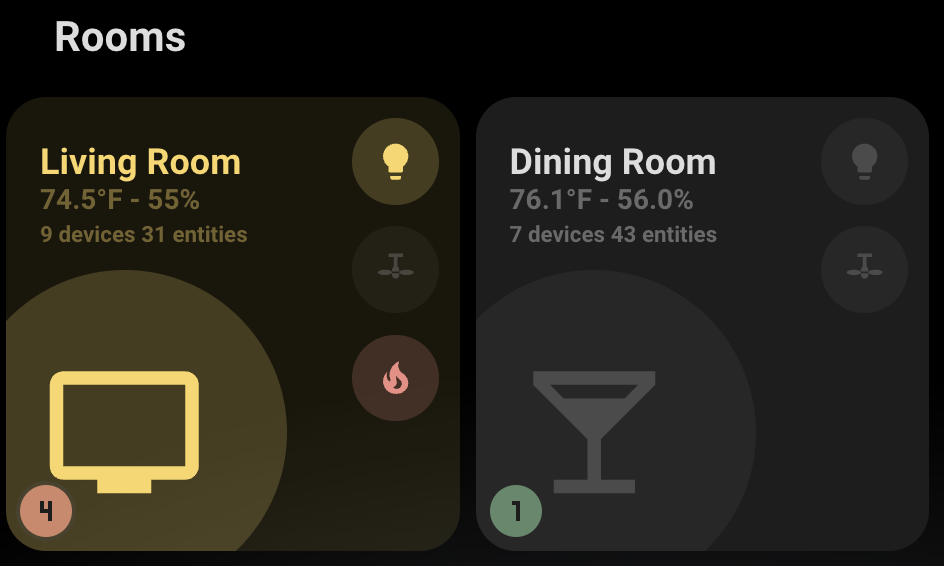

# Problem Entity Detection

The card can automatically detect and monitor "problem" entities in your areas using two methods:

- **Label-based detection**: Entities with the "problem" label
- **Device class detection**: Entities with `device_class: problem`

### Setting Up Problem Detection

You can use either method (or both) to mark entities as problems:

1. **Label entities** with "problem" in Home Assistant:
   - Go to Settings → Areas & Labels
   - Create or edit labels
   - Add "problem" label to relevant entities

2. **Use device_class: problem**:
   - Configure entities with `device_class: problem` in their entity configuration
   - This is particularly useful for binary sensors that represent problem states

3. **Area assignment**: Problem entities must be in the same area as the card, either:
   - Directly assigned to the area
   - Belong to a device assigned to the area


### How It Works

The card automatically:

- Finds entities with "problem" label **or** `device_class: problem` in the specified area
- Checks if any are currently active using `stateActive()` function
- Displays a counter with the total number of problem entities
- Shows green indicator if no problems are active
- Shows red indicator if any problems are active
- **Mold Detection**: Displays an animated mold indicator when mold levels exceed configured thresholds
- **Clickable Indicator**: Click the problem indicator (numbered badge) to open a dialog showing all problem entities with their names, states, and active/inactive status. Each entity in the dialog can be clicked to open its more-info dialog for detailed information.




### Problem Indicator Display Options

You can control how the problem indicator is displayed using the `problem.display` configuration option:

```yaml
type: custom:room-summary-card
area: living_room
problem:
  display: always # Options: always, active_only, never
```

**Display Modes:**

- **`always`** (default): Shows the indicator at all times
  - Green circle when no problems are active
  - Red pulsing circle when problems are active
  - This is the default behavior

- **`active_only`**: Only shows the indicator when problems are active
  - Hides the green circle when no problems are active
  - Shows red pulsing circle only when problems exist
  - Useful if you only want to see the indicator when there's an actual issue

- **`never`**: Completely hides the problem indicator
  - The indicator will not be displayed regardless of problem status
  - Note: The mold indicator will still display if configured and threshold is exceeded

**Example Configurations:**

```yaml
# Show indicator only when problems are active
type: custom:room-summary-card
area: living_room
problem:
  display: active_only

# Hide the indicator completely
type: custom:room-summary-card
area: living_room
problem:
  display: never

# Always show (default behavior)
type: custom:room-summary-card
area: living_room
problem:
  display: always
```

### Mold Indicator

The mold indicator appears in the bottom left area near problem entities and provides:

- **Animated Warning**: Pulsing red gradient background with bouncing effects
- **Visual Prominence**: Warning triangle (⚠) with flashing animation
- **Threshold Control**: Only displays when mold levels exceed your configured threshold
- **Hover Effects**: Scales up and intensifies animations on hover
- **Dark Theme Support**: Automatically adjusts colors for dark themes


### Example Problem Entities

Common entities to mark as problems (using labels or device_class):

- Smoke detectors (`binary_sensor.smoke_detector`) - can use `device_class: problem`
- Water leak sensors (`binary_sensor.water_leak`) - can use `device_class: problem`
- Door/window sensors (`binary_sensor.front_door`)
- Low battery sensors (`sensor.device_battery`)
- Offline device indicators
- Any binary sensor with `device_class: problem` will be automatically detected
