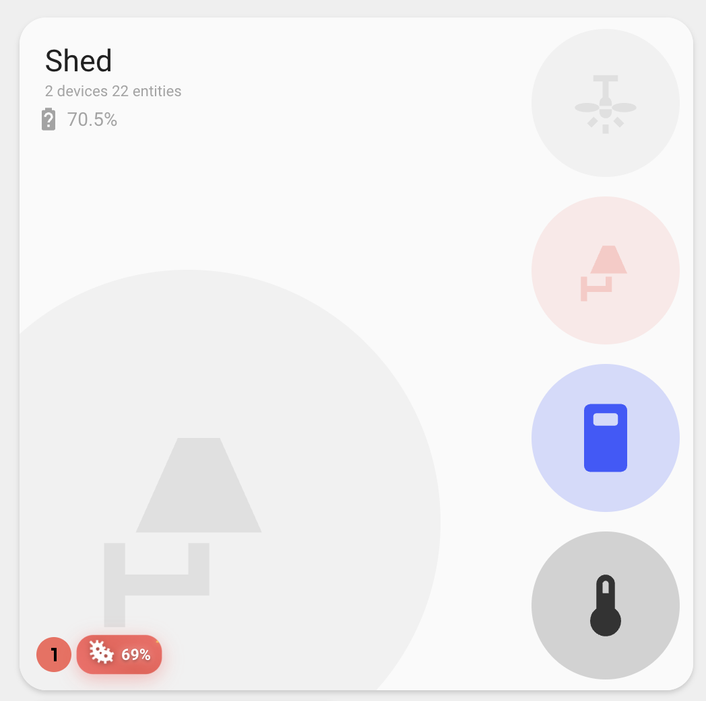

## Problem Entity Detection

The card can automatically detect and monitor "problem" entities in your areas using Home Assistant labels.

### Setting Up Problem Detection

1. **Label entities** with "problem" in Home Assistant:
   - Go to Settings → Areas & Labels
   - Create or edit labels
   - Add "problem" label to relevant entities

2. **Area assignment**: Problem entities must be in the same area as the card, either:
   - Directly assigned to the area
   - Belong to a device assigned to the area

### How It Works

The card automatically:

- Finds entities with "problem" label in the specified area
- Checks if any are currently active using `stateActive()` function
- Displays a counter with the total number of problem entities
- Shows green indicator if no problems are active
- Shows red indicator if any problems are active
- **Mold Detection**: Displays an animated mold indicator when mold levels exceed configured thresholds

### Mold Indicator

The mold indicator appears in the bottom left area near problem entities and provides:

- **Animated Warning**: Pulsing red gradient background with bouncing effects
- **Visual Prominence**: Warning triangle (⚠) with flashing animation
- **Threshold Control**: Only displays when mold levels exceed your configured threshold
- **Hover Effects**: Scales up and intensifies animations on hover
- **Dark Theme Support**: Automatically adjusts colors for dark themes

### Example Problem Entities

Common entities to label as "problem":

- Smoke detectors (`binary_sensor.smoke_detector`)
- Water leak sensors (`binary_sensor.water_leak`)
- Door/window sensors (`binary_sensor.front_door`)
- Low battery sensors (`sensor.device_battery`)
- Offline device indicators
