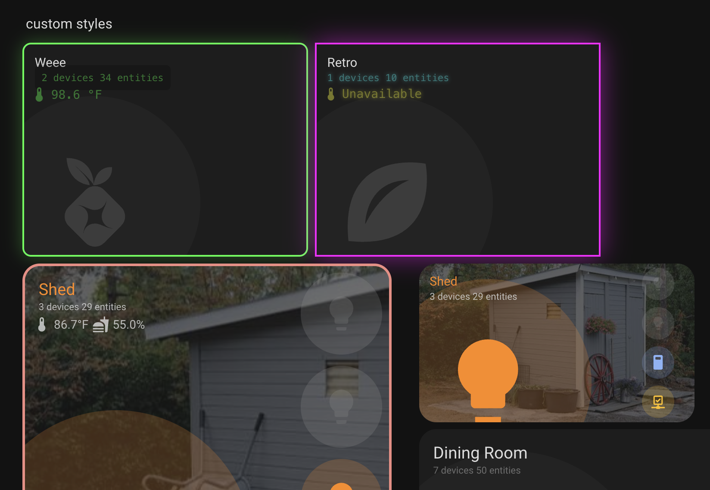

# README Examples

Example YAML configurations to replicate each screenshot shown below. See my personal configuration to see how I use this card: [my dashboard yaml](https://github.com/warmfire540/home-assistant-config-public/blob/home/ui_lovelace_minimalist/dashboard/views/01-home.yaml#L78)

## Entity Icons


```yaml
# Most entities are not configured since it's pulling default entities and sensors by convention.
- type: custom:layout-card
    ...
    cards:
      - type: custom:button-card
        template: card_title
        name: Rooms

      #################
      # LIVING ROOM
      #################
      - type: custom:room-summary-card
        area: living_room
        entities:
          - switch.sconce
          - climate.living_room

      #################
      # DINING ROOM
      #################
      - type: custom:room-summary-card
        area: dining_room

      #################
      # GARAGE
      #################
      - type: custom:room-summary-card
        area: garage
        thresholds:
          temperature: 90
        entities:
          - entity_id: binary_sensor.garage_door_tilt_window_door_is_open
            tap_action:
              action: call-service
              service: switch.toggle
              service_data:
                entity_id: switch.garage_opener
          - switch.garage_opener_plug
```

## Problem Detection


```yaml
#################
# LIVING ROOM
#################
- type: custom:room-summary-card
area: living_room
entities:
- switch.sconce
- climate.living_room

#################
# DINING ROOM
#################
- type: custom:room-summary-card
area: dining_room
```

## Occupancy Detection


```yaml
type: custom:room-summary-card
area: living_room
occupancy:
  entities:
    - binary_sensor.living_room_motion
    - binary_sensor.living_room_occupancy
```

## Sensor Layouts


### Default Layout

```yaml
# headings
- type: heading
  heading_style: title
  heading: Sensor Style Default
  grid_options:
    columns: 9
    rows: 1
- type: heading
  heading_style: title
  heading: Sensor Style Stacked
  grid_options:
    columns: 6
    rows: 1
- type: heading
  heading_style: title
  heading: Sensor Style Bottom
  grid_options:
    columns: 6
    rows: 1
# cards
- type: custom:room-summary-card
  area: attic
  grid_options:
    columns: 6
    rows: 3
- type: custom:room-summary-card
  area: attic
  sensor_layout: stacked
  grid_options:
    columns: 6
    rows: 3
- type: custom:room-summary-card
  area: attic
  sensor_layout: bottom
  grid_options:
    columns: 9
    rows: 3
```

## Background Images

### Area Picture (Automatic)


```yaml
type: custom:room-summary-card
area: living_room
# Uses area picture automatically - no configuration needed
```

### Entity Picture


```yaml
type: custom:room-summary-card
area: bedroom
background:
  image_entity: person.john
  opacity: 40
```

### Custom Background


```yaml
type: custom:room-summary-card
area: living_room
background:
  image: /local/images/living-room.jpg
  opacity: 30
```

## RGB Color Support


```yaml
type: custom:room-summary-card
area: living_room
entities:
  - entity_id: light.living_room_rgb_strip
    icon: mdi:led-strip-variant
    # RGB colors are automatically used from entity's rgb_color attribute
    # No additional configuration needed
```

## Custom Icon Colors


```yaml
# In customize.yaml
customize:
  media_player.netflix:
    icon_color: '#E50914' # Netflix red
    icon: mdi:netflix

  sensor.plex:
    icon_color: '#E5A00D' # Plex gold
    icon: mdi:plex

# Card configuration
type: custom:room-summary-card
area: living_room
entities:
  - media_player.netflix
  - sensor.plex
```

## Multi-Light Background


The above demonstration shows three different multi-light configurations:

```yaml
# Card 1: Mixed entity types with manual light specification
- type: custom:room-summary-card
  area: dining_room
  features:
    - multi_light_background
  entity: light.kitchen_bulb_1
  entities:
    - switch.sconce
    - light.kitchen_bulb_1
  lights:
    - light.dining_room_light
    - switch.sconce
    - light.kitchen_bulb_1

# Card 2: Automatic discovery with default entities excluded
- type: custom:room-summary-card
  area: dining_room
  features:
    - multi_light_background
    - exclude_default_entities

# Card 3: Custom entity as light source
- type: custom:room-summary-card
  area: dining_room
  features:
    - multi_light_background
  entity: input_boolean.gina_mute
  entities:
    - input_boolean.gina_mute
  lights:
    - input_boolean.gina_mute
```

## Custom Styling



```yaml
- type: heading
  icon: ''
  heading: custom styles
  heading_style: title
- type: custom:room-summary-card
  area: server_closet_poat_hole
  area_name: Weee
  navigate: /foo-bar
  grid_options:
    columns: 9
    rows: 4
  styles:
    card:
      background: 'linear-gradient(135deg, #667eea 0%, #764ba2 100%)'
      border: '2px solid #00ff41'
      border-radius: 10px
      box-shadow: 0 0 20px rgba(0, 255, 65, 0.3)
    title:
      color: '#00ff41'
      font-size: 2.5em
      font-weight: bold
      text-shadow: 0 0 10px rgba(0, 255, 65, 0.8)
      text-transform: uppercase
    stats:
      color: '#00ff41'
      font-family: monospace
      background: rgba(0, 0, 0, 0.5)
      padding: 8px
      border-radius: 5px
    sensors:
      color: '#00ff41'
      font-family: monospace
    '--user-icon-size': 20px
- type: custom:room-summary-card
  area: server_closet_poat_seedbox
  area_name: Retro
  navigate: /foo-bar
  grid_options:
    columns: 9
    rows: 4
  styles:
    card:
      background: '#000000'
      border: '2px solid #ff00ff'
      border-radius: 0
      box-shadow: >-
        0 0 30px rgba(255, 0, 255, 0.5), inset 0 0 30px rgba(255, 0,
        255, 0.1)
    title:
      color: '#ff00ff'
      font-size: 2.2em
      font-family: monospace
      text-shadow: '0 0 10px #ff00ff, 0 0 20px #ff00ff'
      text-transform: uppercase
    stats:
      color: '#00ffff'
      font-family: monospace
      text-shadow: '0 0 5px #00ffff'
    sensors:
      color: '#ffff00'
      font-family: monospace
      text-shadow: '0 0 5px #ffff00'
      '--user-icon-size': 18px
```
