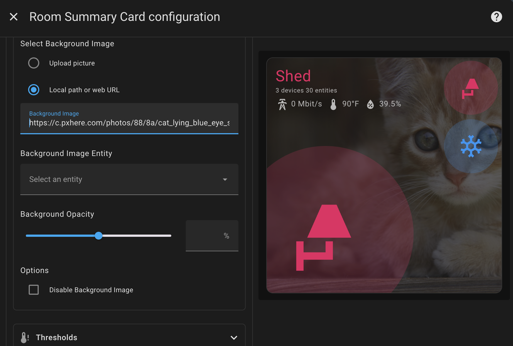
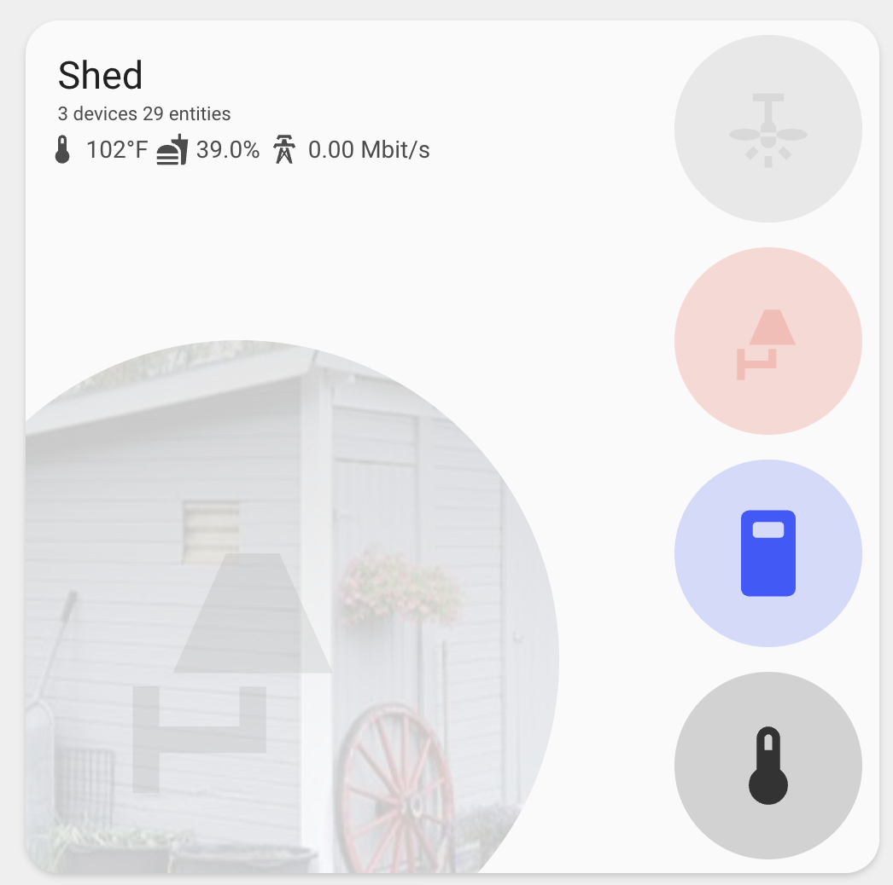
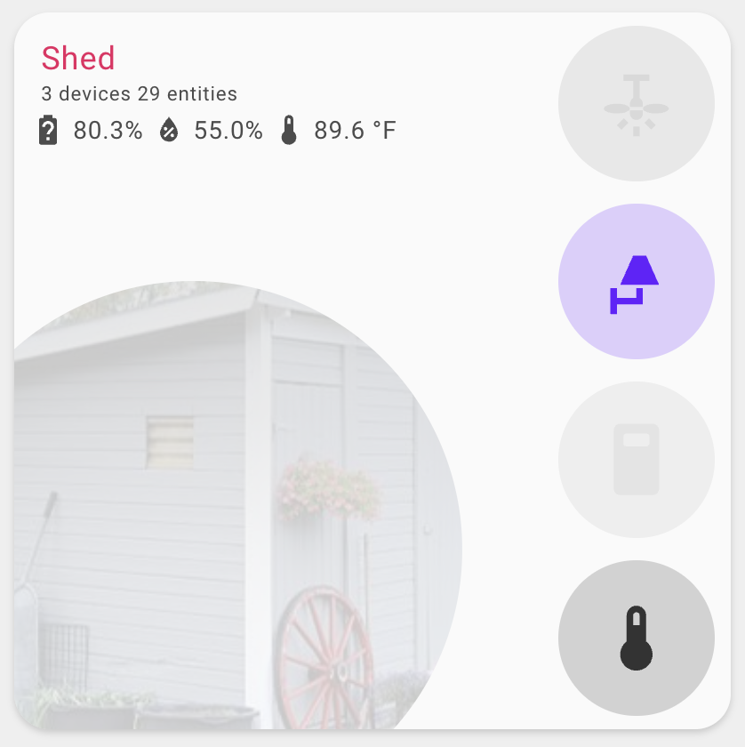

## Background Configuration

Customize the card's background appearance with images and effects:

```yaml
background:
  image: /local/images/living-room.jpg # Custom image path/URL
  image_entity: image.living_room_camera # Dynamic image from entity
  opacity: 30 # Opacity percentage (0-100)
  options:
    - disable # Disable background images entirely
    - icon_background # Apply background to room icon only
    - hide_icon_only # Hide the room icon to show background clearly
```



### Background Options

| Name         | Type   | Default | Description                                                         |
| ------------ | ------ | ------- | ------------------------------------------------------------------- |
| image        | string | none    | URL or path to background image                                     |
| image_entity | string | none    | Entity ID for dynamic background (image, person, camera)            |
| opacity      | number | auto    | Background opacity percentage (0-100)                               |
| options      | array  | none    | Array of options: 'disable', 'icon_background', or 'hide_icon_only' |

### Background Priority

The card uses background images in this priority order:

1. **image_entity**: Dynamic image from specified entity's `entity_picture`
2. **image**: Custom image URL or path
3. **area picture**: Area's picture attribute (automatic fallback)

### Background Options Explained

#### `disable`

Completely disables background images for the card, regardless of other configuration.

#### `icon_background`

When enabled, the background image is applied only to the room icon area instead of the entire card. This creates a more subtle effect where the background image appears behind the room icon while keeping the rest of the card clean.



#### `hide_icon_only`

When enabled, only the icon content (the `ha-state-icon` element) is hidden, while the icon container (the circular background) remains visible. This allows the background image to show through the icon area without any icon overlay, while still maintaining the visual structure and clickable area.

This option is particularly useful for:

- Camera feeds where you want to see the full camera view through the icon area
- Background images that you want to display prominently in the icon location
- Creating a cleaner look while preserving the card's layout and functionality

**Note**: This is different from the `hide_room_icon` feature which completely removes the icon container from the DOM.



### Background Examples

#### Custom Background Image

```yaml
type: custom:room-summary-card
area: living_room
background:
  image: /local/images/living-room.jpg
  opacity: 25
```

#### Dynamic Background from Person Entity

```yaml
type: custom:room-summary-card
area: bedroom
background:
  image_entity: person.john
  opacity: 40
```

#### Using Camera Feed as Background

```yaml
type: custom:room-summary-card
area: garage
background:
  image_entity: camera.garage_cam
  opacity: 20
```

#### Icon-Only Background

```yaml
type: custom:room-summary-card
area: living_room
background:
  image: /local/images/living-room.jpg
  opacity: 50
  options:
    - icon_background
```

#### Disable Background Images

```yaml
type: custom:room-summary-card
area: office
background:
  options:
    - disable
```

#### Combined Options

```yaml
type: custom:room-summary-card
area: master_bedroom
background:
  image_entity: camera.bedroom
  opacity: 30
  options:
    - icon_background
```

#### Hide Icon Only for Camera Feed

```yaml
type: custom:room-summary-card
area: security_room
background:
  image_entity: camera.front_door
  opacity: 40
  options:
    - hide_icon_only
```

#### Hide Icon Only with Custom Background

```yaml
type: custom:room-summary-card
area: living_room
background:
  image: /local/images/living-room.jpg
  opacity: 50
  options:
    - hide_icon_only
```

### Advanced Background Examples

#### Multiple Image Sources with Fallbacks

```yaml
type: custom:room-summary-card
area: security_room
background:
  image_entity: camera.front_door # Primary: live camera feed
  image: /local/images/security-room.jpg # Fallback: static image
  opacity: 35
```

#### Person Entity with Custom Opacity

```yaml
type: custom:room-summary-card
area: guest_room
background:
  image_entity: person.guest
  opacity: 60 # Higher opacity for better visibility
```

#### Area Picture with Icon Background

```yaml
type: custom:room-summary-card
area: kitchen
# No background config needed - uses area picture automatically
# But you can still control opacity and options
background:
  opacity: 40
  options:
    - icon_background
```

### Background Image Sources

#### Local Images

Store images in your Home Assistant `www` directory:

```yaml
background:
  image: /local/images/room.jpg
```

#### External URLs

Use images from the web:

```yaml
background:
  image: https://example.com/room-image.jpg
```

#### Entity Pictures

Use pictures from various entity types:

- **Person entities**: Profile pictures
- **Camera entities**: Live camera feeds
- **Image entities**: Static images from image sensors
- **Media player entities**: Album art or media thumbnails

```yaml
background:
  image_entity: person.family_member
  # or
  image_entity: camera.living_room
  # or
  image_entity: image.room_photo
```

### Opacity Control

The opacity setting controls the transparency of the background image:

- **0**: Completely transparent (background invisible)
- **25**: Subtle background effect
- **50**: Medium visibility
- **75**: Strong background presence
- **100**: Fully opaque background

```yaml
background:
  image: /local/images/room.jpg
  opacity: 25 # Subtle background
```

### Automatic Opacity

When no opacity is specified, the card uses theme-aware automatic opacity:

- **Light mode**: Adjusted opacity based on entity state (active/inactive)
- **Dark mode**: Adjusted opacity based on entity state (active/inactive)
