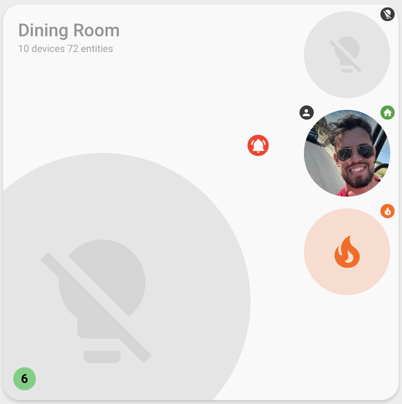

# Badge Configuration

Badges are small overlay icons that appear on entity icons to provide additional visual information. Each entity can have up to 4 badges configured, positioned at the corners of the entity icon.



## Overview

Badges allow you to display:

- Entity state icons (`ha-state-icon`) - automatically shows the state of an entity
- Custom icons (`ha-icon`) - displays a specific icon based on state matching
- Multiple badges per entity - up to 4 badges can be configured
- Flexible positioning - badges can be placed at any corner of the entity icon

## Basic Configuration

Badges are configured as an array within an entity configuration:

```yaml
entities:
  - entity_id: light.living_room
    badges:
      - position: top_right
        mode: show_always
      - position: bottom_left
        mode: if_active
```

## Badge Configuration Options

| Name      | Type   | Default     | Description                                                                                                                                                     |
| --------- | ------ | ----------- | --------------------------------------------------------------------------------------------------------------------------------------------------------------- |
| entity_id | string | parent      | Optional entity ID for the badge (defaults to parent entity)                                                                                                    |
| position  | string | `top_right` | Badge position: `top_right`, `top_left`, `bottom_right`, or `bottom_left`                                                                                       |
| mode      | string | none        | Display mode: `show_always` (always show), `if_active` (show when entity is active), or `homeassistant` (use HA's native badge rendering for supported domains) |
| states    | array  | none        | State-based configuration (when mode is not specified) - uses same format as entity `states`                                                                    |

### Position Options

Badges can be positioned at any of the four corners of the entity icon:

- `top_right` - Top right corner (default)
- `top_left` - Top left corner
- `bottom_right` - Bottom right corner
- `bottom_left` - Bottom left corner

## Display Modes

### Show Always Mode

The `show_always` mode displays the badge at all times, showing the entity's state icon:

```yaml
entities:
  - entity_id: light.living_room
    badges:
      - position: top_right
        mode: show_always
```

This badge will always be visible and will display the current state of `light.living_room` using Home Assistant's state icon.

### If Active Mode

The `if_active` mode displays the badge only when the entity is considered "active" (on, open, playing, etc.):

```yaml
entities:
  - entity_id: switch.living_room_fan
    badges:
      - position: top_right
        mode: if_active
```

This badge will only appear when the switch is on, and will display the active state icon.

### Home Assistant Mode

The `homeassistant` mode uses Home Assistant's native badge rendering system, which provides domain-specific badge displays for certain entity types. This mode is particularly useful for entities that have special badge representations in Home Assistant's tile cards.

**Supported domains:**

- `person` / `device_tracker` - Shows person/device tracker badges
- `climate` - Shows climate control badges (HVAC action, temperature, etc.)
- `humidifier` - Shows humidifier state badges

For unsupported domains, the badge will not be displayed.

```yaml
entities:
  # Climate entity with native HA badge
  - entity_id: climate.living_room
    badges:
      - position: top_right
        mode: homeassistant

  # Person entity with native HA badge
  - entity_id: person.john
    badges:
      - position: top_right
        mode: homeassistant

  # Humidifier entity with native HA badge
  - entity_id: humidifier.bedroom
    badges:
      - position: top_right
        mode: homeassistant
```

This mode renders badges exactly as Home Assistant's tile cards do, ensuring consistency with the native Home Assistant UI.

### State-Based Mode

When no `mode` is specified, badges use state-based matching similar to entity `states` configuration. This allows you to display custom icons and colors based on specific entity states:

```yaml
entities:
  - entity_id: climate.living_room
    badges:
      - position: top_right
        states:
          - state: heating
            icon: mdi:radiator
            icon_color: red
          - state: cooling
            icon: mdi:snowflake
            icon_color: blue
          - state: 'off'
            icon: mdi:power-off
            icon_color: grey
```

The badge will only appear when one of the configured states matches, displaying the corresponding icon and color.

## Badge Entity ID

By default, badges display information about their parent entity. However, you can configure a badge to display information about a different entity:

```yaml
entities:
  - entity_id: light.living_room
    badges:
      # Badge showing the parent entity state
      - position: top_right
        mode: show_always
      # Badge showing a different entity's state
      - position: top_left
        entity_id: sensor.living_room_temperature
        mode: show_always
```

This is useful when you want to show related entity information on a main entity icon.

## State Configuration

When using state-based badges (no `mode` specified), the `states` array uses the same configuration format as entity `states`:

| Name       | Type   | Default      | Description                                              |
| ---------- | ------ | ------------ | -------------------------------------------------------- |
| state      | string | **Required** | Entity state or attribute value to match exactly         |
| icon_color | string | **Required** | Color to use when this state is active                   |
| icon       | string | none         | Icon to use when this state is active                    |
| attribute  | string | none         | Optional attribute name to match instead of entity state |
| styles     | object | none         | Custom CSS styles to apply to the badge icon             |

### State-Based Badge Examples

```yaml
entities:
  # Climate entity with HVAC action badge
  - entity_id: climate.living_room
    badges:
      - position: top_right
        states:
          - state: heating
            attribute: hvac_action
            icon: mdi:radiator
            icon_color: red
          - state: cooling
            attribute: hvac_action
            icon: mdi:snowflake
            icon_color: blue
          - state: idle
            attribute: hvac_action
            icon: mdi:fan-off
            icon_color: grey

  # Cover entity with position-based badge
  - entity_id: cover.window_blinds
    badges:
      - position: top_right
        states:
          - state: '100'
            attribute: current_position
            icon: mdi:window-shutter-open
            icon_color: green
          - state: '0'
            attribute: current_position
            icon: mdi:window-shutter
            icon_color: grey

  # Media player with playback state badge
  - entity_id: media_player.tv
    badges:
      - position: top_right
        states:
          - state: playing
            icon: mdi:play-circle
            icon_color: green
          - state: paused
            icon: mdi:pause-circle
            icon_color: orange
          - state: 'off'
            icon: mdi:stop-circle
            icon_color: grey
```

## Multiple Badges

You can configure up to 4 badges per entity, each at a different position:

```yaml
entities:
  - entity_id: light.living_room
    badges:
      # Always show entity state
      - position: top_right
        mode: show_always
      # Show when active
      - position: top_left
        mode: if_active
      # Show brightness level badge
      - position: bottom_right
        states:
          - state: '255'
            attribute: brightness
            icon: mdi:brightness-7
            icon_color: yellow
          - state: '128'
            attribute: brightness
            icon: mdi:brightness-4
            icon_color: orange
          - state: '0'
            attribute: brightness
            icon: mdi:brightness-1
            icon_color: grey
      # Show related sensor badge
      - position: bottom_left
        entity_id: sensor.living_room_temperature
        mode: show_always
```

## Attribute-Based Matching

Badges support matching on entity attributes, just like entity `states` configuration:

```yaml
entities:
  - entity_id: climate.living_room
    badges:
      - position: top_right
        states:
          # Match on hvac_action attribute instead of entity state
          - state: heating
            attribute: hvac_action
            icon: mdi:radiator
            icon_color: red
          - state: cooling
            attribute: hvac_action
            icon: mdi:snowflake
            icon_color: blue
```

**Note**: When using attributes, numeric values must be quoted as strings (e.g., `'100'` instead of `100`).

## Badge Styling

Badges support custom CSS styles through the `styles` property in state configurations:

```yaml
entities:
  - entity_id: sensor.door_sensor
    badges:
      - position: top_right
        states:
          - state: 'on'
            icon: mdi:door-open
            icon_color: red
            styles:
              keyframes: |-
                pulse {
                  0%, 100% { opacity: 1; transform: scale(1); }
                  50% { opacity: 0.7; transform: scale(1.1); }
                }
              animation: pulse 2s ease-in-out infinite
```

## Complete Examples

### Climate Entity with HVAC Action Badge

```yaml
entities:
  - entity_id: climate.living_room
    badges:
      - position: top_right
        states:
          - state: heating
            attribute: hvac_action
            icon: mdi:radiator
            icon_color: red
          - state: cooling
            attribute: hvac_action
            icon: mdi:snowflake
            icon_color: blue
          - state: idle
            attribute: hvac_action
            icon: mdi:fan-off
            icon_color: grey
```

### Light with Multiple Badges

```yaml
entities:
  - entity_id: light.living_room
    badges:
      # Always show state
      - position: top_right
        mode: show_always
      # Show brightness indicator when active
      - position: top_left
        mode: if_active
        states:
          - state: '255'
            attribute: brightness
            icon: mdi:brightness-7
            icon_color: yellow
          - state: '128'
            attribute: brightness
            icon: mdi:brightness-4
            icon_color: orange
      # Show related temperature sensor
      - position: bottom_right
        entity_id: sensor.living_room_temperature
        mode: show_always
```

### Media Player with Playback State

```yaml
entities:
  - entity_id: media_player.tv
    badges:
      - position: top_right
        states:
          - state: playing
            icon: mdi:play-circle
            icon_color: green
          - state: paused
            icon: mdi:pause-circle
            icon_color: orange
          - state: 'off'
            icon: mdi:stop-circle
            icon_color: grey
```

## Best Practices

1. **Limit badges**: While up to 4 badges are supported, use them sparingly to avoid cluttering the interface
2. **Use modes when possible**: `show_always`, `if_active`, and `homeassistant` modes are simpler than state-based configuration
3. **Use `homeassistant` mode for supported domains**: For `person`, `device_tracker`, `climate`, and `humidifier` entities, use `homeassistant` mode to get native Home Assistant badge rendering
4. **Position strategically**: Place the most important badge at `top_right` (most visible)
5. **Use related entities**: Badges are great for showing related sensor data on main entity icons
6. **Match entity states**: Use state-based badges when you need custom icons or colors for specific states

## Related Documentation

- [Entity Configuration](ENTITY-CONFIGURATION.md) - Complete entity configuration options
- [Entity Color Configuration](ENTITY-COLOR-CONFIGURATION.md) - Color customization options
- [Entity Attributes](ENTITY-ATTRIBUTES.md) - Working with entity attributes
