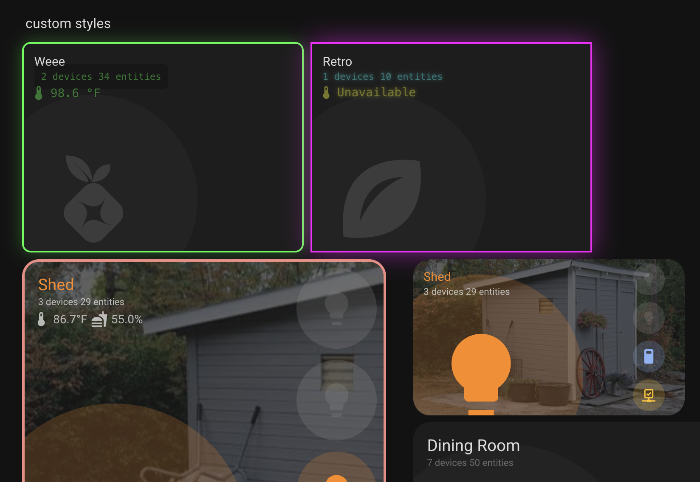
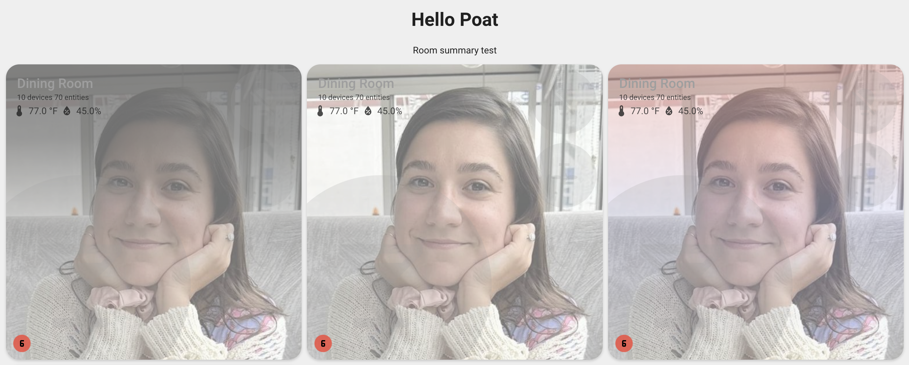

# Custom Styles Configuration

The Room Summary Card now supports custom CSS styles for different areas of the card, allowing you to completely customize the appearance to match your theme or personal preferences.



## Overview

Custom styles can be applied to the main areas of the card:

- **`card`** - The entire card container and background
- **`entities`** - The entity container
- **`entity_icon`** - Individual entity icons (global styles for all entities)
- **`title`** - The room name/title text
- **`stats`** - The area statistics (device/entity counts)
- **`sensors`** - The sensor display area and sensor styling

**Note**: In addition to global `entity_icon` styles, you can also apply styles directly to individual entities using the `styles` property in entity configuration. Entity-level styles override global `entity_icon` styles, and threshold/state styles override entity-level styles.

## Basic Usage

```yaml
type: custom:room-summary-card
area: living_room
styles:
  title:
    color: white
    font-size: 2em
  card:
    background: 'linear-gradient(45deg, #ff6b6b, #4ecdc4)'
  entities:
    grid-template-rows: 1fr 1fr !important;
    grid-template-columns: 1fr 1fr !important;
```

## Style Areas

### Card Styles

Control the overall card appearance:

```yaml
styles:
  card:
    background: none # Remove default background
    border: '2px solid #ff6b6b' # Add border
    border-radius: 15px # Rounded corners
    aspect-ratio: '16/9' # Change card proportions
    box-shadow: '0 4px 8px rgba(0,0,0,0.2)'
```

#### Customizing Grid Layout


You can customize the main grid layout using CSS variables:

```yaml
styles:
  card:
    '--user-grid-template-areas': "'i e'" # Horizontal layout: info left, entities right
    '--user-grid-template-columns': '1fr 1.2fr' # Column sizes
    '--user-grid-template-rows': '1fr' # Single row
    '--user-grid-aspect-ratio': '16/9' # Change card aspect ratio
```

**Horizontal Layout Example:**

```yaml
type: custom:room-summary-card
area: living_room
entities:
  - vacuum.joey_essex
  - cover.living_room_blinds
  - input_boolean.air_filters_need_changed
  - sensor.living_room_blinds_battery
styles:
  entities:
    grid-template-columns: 1fr 1fr 1fr 1fr !important
    grid-template-rows: 1fr  !important
    align-items: normal !important
  card:
    '--user-grid-template-areas': "'i e'"
    '--user-grid-template-columns': 1fr 1fr
    '--user-grid-template-rows': 1fr
    '--user-grid-aspect-ratio': 7/1
  title:
    margin-top: 14%
features:
  - exclude_default_entities
  - hide_area_stats
  - hide_room_icon
```

**Making the Card Rectangular and Shape to Content:**

To make the card rectangular and size to its content instead of being square:

```yaml
styles:
  card:
    '--user-grid-template-areas': "'i e'"
    '--user-grid-template-columns': '1fr 1.2fr'
    '--user-grid-template-rows': '1fr'
    '--user-grid-aspect-ratio': 'auto' # Remove aspect ratio constraint, size to content
    # Or use a rectangular aspect ratio:
    # '--user-grid-aspect-ratio': '16/9'  # Wide rectangular
    # '--user-grid-aspect-ratio': '2/1'   # Very wide
    # '--user-grid-aspect-ratio': '3/2'   # Slightly wide
```

**Common Aspect Ratio Values:**

- `'auto'` or `'none'` - Remove aspect ratio, size to content
- `'16/9'` - Wide rectangular (common for horizontal layouts)
- `'2/1'` - Very wide rectangular
- `'3/2'` - Slightly wide rectangular
- `'1/1'` - Square (default)

**Note:** For `grid-template-areas`, use single quotes around the entire value, and each row should be separated by spaces. For example:

- Single row: `"'i e'"` (info left, entities right)
- Default 4x4 grid: `"'i i i e' 'i i i e' 'r r . e' 'r r . e'"` (info, room icon, entities)

#### Customizing Card Background Image Overlay

When using card background images, you can customize or remove the default gradient overlay using the same `--user-background-image-overlay` variable:

**Remove the gradient overlay:**

```yaml
styles:
  card:
    '--user-background-image-overlay': none
```

**Use a custom gradient:**

```yaml
styles:
  card:
    '--user-background-image-overlay': 'linear-gradient(to bottom, rgba(0,0,0,0.5), rgba(0,0,0,0.2), transparent)'
```

**Use a solid color overlay:**

```yaml
styles:
  card:
    '--user-background-image-overlay': 'rgba(0, 0, 0, 0.3)'
```

### Entity Styles

Control the entity container:

```yaml
styles:
  entities:
    background: red # Remove default background
    border: '2px solid #ff6b6b' # Add border
    border-radius: 15px # Rounded corners
    grid-template-rows: 1fr 1fr !important; # 2 rows
    grid-template-columns: 1fr 1fr !important; # 2 columns
```

### Entity Icon Styles

Control individual entity icons globally:

```yaml
styles:
  entity_icon:
    width: 50% # Icon size
    opacity: 0.8 # Icon opacity
    filter: 'drop-shadow(2px 2px 4px rgba(0,0,0,0.3))' # Add shadow
    transform: 'scale(1.2)' # Make icons larger
```

#### Customizing Icon Background Image Overlay

When using icon backgrounds with images, you can customize or remove the default gradient overlay:



**Remove the gradient overlay:**

```yaml
styles:
  card:
    '--user-background-image-overlay': none
```

**Use a custom gradient:**

```yaml
styles:
  card:
    '--user-background-image-overlay': 'linear-gradient(to bottom, rgba(255,0,0,0.3), rgba(0,0,255,0.1), transparent)'
```

**Use a solid color overlay:**

```yaml
styles:
  card:
    '--user-background-image-overlay': 'linear-gradient(rgba(0, 0, 0, 0.2), rgba(0, 0, 0, 0.2))'
```

### Per-Entity Styles

Apply styles directly to individual entities for per-entity customization:

```yaml
entities:
  - entity_id: light.living_room
    styles:
      '--user-entity-label-display': none # Hide label for this entity
      opacity: 0.9
      transform: scale(1.1)
  - entity_id: switch.kitchen
    styles:
      border: '2px solid red'
      border-radius: '50%'
```

**Style Priority:**

1. Threshold/state styles (highest priority)
2. Entity-level styles (middle priority)
3. Global `entity_icon` styles (lowest priority)

#### Hide Icon Backgrounds

For cleaner icons without background fills:

```yaml
styles:
  entity_icon:
    '--opacity-icon-fill-inactive': 0
    '--opacity-icon-fill-active': 0
```

This is particularly useful when using the `show_entity_labels` feature for a cleaner, more minimal appearance.

### Title Styles

Customize the room name display:

```yaml
styles:
  title:
    color: '#ffffff' # Text color
    font-size: 3em # Large title
    font-weight: bold # Bold text
    text-shadow: '2px 2px 4px rgba(0,0,0,0.5)'
    text-transform: uppercase # UPPERCASE text
```

### Stats Styles

Style the area statistics:

```yaml
styles:
  stats:
    color: yellow # Stats text color
    font-size: 1.2em # Larger stats text
    opacity: 1 # Full opacity (override theme)
    background: 'rgba(0,0,0,0.3)' # Semi-transparent background
    padding: 5px # Add padding
    border-radius: 5px # Rounded background
```

### Sensor Styles

Customize sensor display and icons:

```yaml
styles:
  sensors:
    color: red # Sensor text color
    font-size: 18px # Sensor text size
    '--user-sensor-icon-size': 24px # Sensor icon size (CSS variable)
    font-weight: bold # Bold sensor text
    opacity: 1 # Override theme opacity
```

## Advanced Examples

### Gaming Room Theme

```yaml
type: custom:room-summary-card
area: gaming_room
area_name: 'Gaming Den'
styles:
  card:
    background: 'linear-gradient(135deg, #667eea 0%, #764ba2 100%)'
    border: '2px solid #00ff41'
    border-radius: 10px
    box-shadow: '0 0 20px rgba(0, 255, 65, 0.3)'
  title:
    color: '#00ff41'
    font-size: 2.5em
    font-weight: bold
    text-shadow: '0 0 10px rgba(0, 255, 65, 0.8)'
    text-transform: uppercase
  stats:
    color: '#00ff41'
    font-family: 'monospace'
    background: 'rgba(0, 0, 0, 0.5)'
    padding: 8px
    border-radius: 5px
  sensors:
    color: '#00ff41'
    font-family: 'monospace'
    '--user-sensor-icon-size': 20px
```

### Minimalist Clean Theme

```yaml
type: custom:room-summary-card
area: bedroom
styles:
  card:
    background: 'rgba(255, 255, 255, 0.1)'
    border: '1px solid rgba(255, 255, 255, 0.2)'
    border-radius: 20px
    backdrop-filter: 'blur(10px)'
  title:
    color: '#ffffff'
    font-size: 1.8em
    font-weight: 300
    letter-spacing: 2px
  stats:
    color: 'rgba(255, 255, 255, 0.7)'
    font-size: 0.9em
  sensors:
    color: 'rgba(255, 255, 255, 0.8)'
    '--user-sensor-icon-size': 16px
```

### Retro Neon Theme

```yaml
type: custom:room-summary-card
area: workshop
area_name: 'Workshop'
styles:
  card:
    background: '#000000'
    border: '2px solid #ff00ff'
    border-radius: 0
    box-shadow: '0 0 30px rgba(255, 0, 255, 0.5), inset 0 0 30px rgba(255, 0, 255, 0.1)'
  title:
    color: '#ff00ff'
    font-size: 2.2em
    font-family: 'monospace'
    text-shadow: '0 0 10px #ff00ff, 0 0 20px #ff00ff'
    text-transform: uppercase
  stats:
    color: '#00ffff'
    font-family: 'monospace'
    text-shadow: '0 0 5px #00ffff'
  sensors:
    color: '#ffff00'
    font-family: 'monospace'
    text-shadow: '0 0 5px #ffff00'
    '--user-sensor-icon-size': 18px
```

## CSS Variables

Some styles use CSS variables that can be overridden:

| Variable                          | Area              | Description                                                                         |
| --------------------------------- | ----------------- | ----------------------------------------------------------------------------------- |
| `--user-room-icon-size`           | card              | Size of room icon                                                                   |
| `--user-entity-icon-size`         | entity_icon       | Size of entity icons                                                                |
| `--user-sensor-icon-size`         | sensors           | Size of sensor icons                                                                |
| `--user-entity-label-display`     | entity_icon       | Control entity label display (set to `none` to hide)                                |
| `--user-background-image-overlay` | card, entity_icon | Overlay gradient for card and icon background images (set to `none` to remove)      |
| `--user-grid-template-areas`      | card              | Grid template areas for main layout (e.g., `"'i e'"` for horizontal layout)         |
| `--user-grid-template-columns`    | card              | Grid template columns (e.g., `1fr 1.2fr` for two columns)                           |
| `--user-grid-template-rows`       | card              | Grid template rows (e.g., `1fr` for single row)                                     |
| `--user-grid-aspect-ratio`        | card              | Aspect ratio of the grid container (e.g., `16/9`, `1/1`, `auto` to size to content) |

Example:

```yaml
styles:
  card:
    '--user-room-icon-size': 50% # Room icon size
  sensors:
    '--user-sensor-icon-size': 30px # Large sensor icons
  entity_icon:
    '--user-entity-icon-size': 28px # Entity icon size
    '--mdc-icon-size': 28px # Individual icon size
    '--user-entity-label-display': none # Hide all entity labels
```

### Hiding Individual Entity Labels

You can hide labels for specific entities by setting the `--user-entity-label-display` CSS variable in the entity's styles:

```yaml
entities:
  - entity_id: light.living_room
    styles:
      '--user-entity-label-display': none # Hide label for this specific entity
  - entity_id: switch.kitchen
    # This entity will still show its label
```

You can also hide labels conditionally based on state or threshold:

```yaml
entities:
  - entity_id: sensor.temperature
    thresholds:
      - threshold: 75
        styles:
          '--user-entity-label-display': none # Hide label when temperature >= 75
```

## Home Assistant Variables

> **Note:** The following Home Assistant CSS variables can be overridden, but these are not officially supported and may change with Home Assistant updates. Use at your own discretion.

| Variable                        | Description                      |
| ------------------------------- | -------------------------------- |
| `--background-color-card`       | Background color of the card     |
| `--icon-primary-color`          | Primary color for icons          |
| `--state-color-icon-theme`      | Theme color for state icons      |
| `--opacity-background-inactive` | Opacity for inactive backgrounds |
| `--opacity-background-active`   | Opacity for active backgrounds   |
| `--opacity-icon-inactive`       | Opacity for inactive icons       |
| `--opacity-icon-fill-inactive`  | Opacity for inactive icon fills  |
| `--opacity-icon-active`         | Opacity for active icons         |
| `--opacity-icon-fill-active`    | Opacity for active icon fills    |

Example:

```yaml
styles:
  card:
    '--background-color-card': orange
    '--icon-primary-color': black
    '--state-color-icon-theme': '#FF5349'
    '--opacity-background-inactive': 0.2
    '--opacity-icon-inactive': 0.2
    '--opacity-icon-fill-inactive': 0.2
    '--opacity-background-active': 1
    '--opacity-icon-active': 1
    '--opacity-icon-fill-active': 1
  entity_icon:
    '--icon-primary-color': black
    '--state-color-icon-theme': '#FF5349'
    '--opacity-icon-inactive': 0.2
    '--opacity-icon-fill-inactive': 0.2
    '--opacity-icon-active': 1
    '--opacity-icon-fill-active': 1
```

## Combining with Features

Custom styles work alongside feature flags:

```yaml
type: custom:room-summary-card
area: kitchen
features:
  - hide_sensor_icons # Hide sensor icons but keep text
styles:
  sensors:
    font-size: 20px # Larger sensor text
    color: red # Red sensor text
  title:
    color: blue # Blue title
```

### Icon-Only Sensor Display

```yaml
type: custom:room-summary-card
area: bathroom
features:
  - hide_sensor_labels # Hide text labels, show icons only
sensor_layout: bottom
styles:
  sensors:
    gap: 20px # Space between icons
```

## Tips and Best Practices

### Color Values

- Use hex colors: `#ff6b6b`
- Use RGB: `rgb(255, 107, 107)`
- Use color names: `red`, `blue`, `yellow`
- Use theme variables: `var(--primary-color)`

### Font Sizes

- Use relative units: `1.5em`, `120%`
- Use absolute units: `18px`, `1.2rem`
- Use CSS functions: `clamp(1rem, 4vw, 2rem)`

### Backgrounds

- Solid colors: `#ffffff`
- Gradients: `linear-gradient(45deg, #ff6b6b, #4ecdc4)`
- Remove background: `none` or `transparent`
- Images: `url('/local/image.jpg')`

### Responsive Design

Consider using responsive units:

```yaml
styles:
  title:
    font-size: clamp(1rem, 5vw, 3rem) # Responsive font size
```

### Theme Integration

Reference theme variables:

```yaml
styles:
  title:
    color: var(--primary-text-color)
  card:
    border: '1px solid var(--divider-color)'
```

## Troubleshooting

**Styles not applying?**

- Check YAML syntax and indentation
- Ensure style names are correct (`card`, `title`, `stats`, `sensors`)
- Try clearing browser cache

**Colors not working?**

- Verify color format (hex, rgb, color names)
- Check if theme overrides are conflicting

**CSS variables not working?**

- Ensure quotes around variable names: `"--user-sensor-icon-size"`
- Check if the variable is supported in that area
