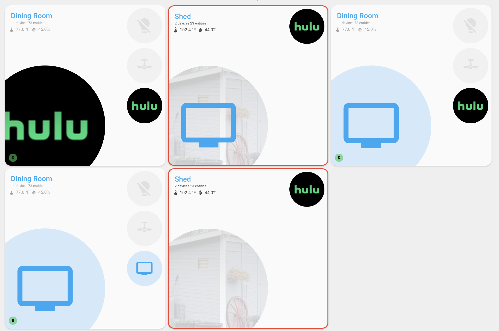

# Entity Configuration

Entities can be specified in two ways, with full color customization options:

## Simple String Format

```yaml
entities:
  - light.living_room_lamp
  - switch.living_room_tv
```

## Detailed Object Format

```yaml
entities:
  - entity_id: light.living_room_lamp
    icon: mdi:lamp
    on_color: yellow
    off_color: grey
    styles:
      '--user-entity-label-display': none # Hide label for this entity
    tap_action:
      action: toggle
  - entity_id: switch.living_room_tv
    icon: mdi:television
    on_color: blue
    off_color: disabled
```

## Entity Configuration Options

| Name              | Type   | Default                 | Description                                                                                           |
| ----------------- | ------ | ----------------------- | ----------------------------------------------------------------------------------------------------- |
| entity_id         | string | **Required**            | Entity ID in Home Assistant                                                                           |
| icon              | string | entity default          | Custom MDI icon                                                                                       |
| label             | string | none                    | Custom label to display instead of entity name (when `show_entity_labels` is enabled) or sensor state |
| attribute         | string | none                    | Attribute to display instead of entity state                                                          |
| on_color          | string | domain default          | Color when entity is active                                                                           |
| off_color         | string | theme off color         | Color when entity is inactive                                                                         |
| thresholds        | array  | none                    | Dynamic colors/icons based on sensor values                                                           |
| states            | array  | none                    | Colors/icons based on exact entity states                                                             |
| styles            | object | none                    | Custom CSS styles to apply to the entity                                                              |
| features          | array  | none                    | Feature flags for this entity                                                                         |
| tap_action        | object | `{action: "toggle"}`    | Action on single tap                                                                                  |
| hold_action       | object | `{action: "more-info"}` | Action on hold                                                                                        |
| double_tap_action | object | `{action: "none"}`      | Action on double tap                                                                                  |

### Threshold Configuration Options

| Name        | Type   | Default      | Description                                                                        |
| ----------- | ------ | ------------ | ---------------------------------------------------------------------------------- |
| threshold   | number | **Required** | Threshold value to compare against entity state or attribute                       |
| icon_color  | string | **Required** | Color to use when this threshold condition is met                                  |
| title_color | string | none         | Color to use for the card title when this threshold condition is met               |
| icon        | string | none         | Icon to use when this threshold condition is met                                   |
| label       | string | none         | Custom label to display when this threshold matches (overrides entity-level label) |
| operator    | string | `gte`        | Comparison operator: `gt`, `gte`, `lt`, `lte`, `eq`                                |
| attribute   | string | none         | Optional attribute name to compare instead of entity state                         |
| styles      | object | none         | Custom CSS styles to apply to entity icon                                          |

### State Configuration Options

| Name        | Type   | Default      | Description                                                                    |
| ----------- | ------ | ------------ | ------------------------------------------------------------------------------ |
| state       | string | **Required** | Entity state or attribute value to match exactly                               |
| icon_color  | string | **Required** | Color to use when this state is active                                         |
| title_color | string | none         | Color to use for the card title when this state is active                      |
| icon        | string | none         | Icon to use when this state is active                                          |
| label       | string | none         | Custom label to display when this state matches (overrides entity-level label) |
| attribute   | string | none         | Optional attribute name to match instead of entity state                       |
| styles      | object | none         | Custom CSS styles to apply to entity icon                                      |

### Entity Features

The `features` array allows you to enable specific behaviors for individual entities:

| Feature         | Description                                     |
| --------------- | ----------------------------------------------- |
| use_entity_icon | Display entity icon instead of `entity_picture` |

### Action Configuration

For `tap_action`, `hold_action`, and `double_tap_action` configuration options, see the [Home Assistant Actions Documentation](https://www.home-assistant.io/dashboards/actions/).

## Entity Picture Display

By default, entities will display their `entity_picture` attribute (if available) instead of an icon. This is particularly useful for media players that have service-specific icons (Netflix, Hulu, Spotify, etc.).



📖 **See [Entity Picture Attributes](../advanced/README-EXAMPLES.md#entity-picture-attributes) for configuration details.**

### Disabling Entity Pictures

To force an entity to use its icon instead of its entity picture, add the `use_entity_icon` feature:

```yaml
entities:
  # Display entity picture (default behavior)
  - entity_id: media_player.tv

  # Force icon display even if entity_picture exists
  - entity_id: media_player.second_tv
    features:
      - use_entity_icon
```

## Color Priority

Colors are applied in this order:

1. **State-based colors** (exact state matches)
2. **Threshold colors** (based on sensor values)
3. **Entity config** (`on_color`, `off_color`)
4. **Entity attributes** (set via `customize.yaml`)
5. **Theme colors** (minimalist or HA colors)
6. **Domain defaults** (automatic colors by entity type)

## Color & Icon Examples

```yaml
entities:
  # Netflix-themed media player
  - entity_id: media_player.netflix
    icon: mdi:netflix

  # Traffic light system
  - entity_id: switch.system_status
    icon: mdi:traffic-light
    on_color: green
    off_color: red

  # Garage door with custom colors
  - entity_id: cover.garage_door
    icon: mdi:garage
    on_color: amber
    off_color: grey

  # Battery sensor with threshold-based colors and icons
  - entity_id: sensor.phone_battery
    icon: mdi:battery
    thresholds:
      - threshold: 80
        icon_color: green
        icon: mdi:battery-high
      - threshold: 50
        icon_color: orange
        icon: mdi:battery-medium
      - threshold: 20
        icon_color: red
        icon: mdi:battery-low
        styles:
          keyframes: |-
            pulse {
              0%, 100% { opacity: 1; transform: scale(1); }
              50% { opacity: 0.7; transform: scale(1.05); }
            }
          animation: pulse 2s ease-in-out infinite
      - threshold: 10
        icon_color: red
        icon: mdi:battery-alert
        styles:
          keyframes: |-
            shake {
              0%, 100% { transform: translateX(0) scale(1.1); }
              25% { transform: translateX(-5px) scale(1.1); }
              75% { transform: translateX(5px) scale(1.1); }
            }
          animation: shake 1s ease-in-out infinite

  # Washing machine with state-based colors and icons
  - entity_id: sensor.washing_machine_state
    icon: mdi:washing-machine
    states:
      - state: running
        icon_color: green
        icon: mdi:play
        styles:
          transform: scale(1.1)
      - state: rinsing
        icon_color: orange
        icon: mdi:sync
      - state: spinning
        icon_color: blue
        icon: mdi:rotate-3d-variant
        styles:
          keyframes: |-
            spin {
              from { transform: rotate(0deg); }
              to { transform: rotate(360deg); }
            }
          animation: spin 2s linear infinite
      - state: finished
        icon_color: purple
        icon: mdi:check-circle
        styles:
          border: 2px solid var(--primary-color)
          border-radius: 50%

  # Light with title color control based on state
  - entity_id: light.living_room
    states:
      - state: 'on'
        icon_color: blue
        title_color: pink
      - state: 'off'
        icon_color: red
        title_color: green
```

## Attribute-Based Matching

Both `states` and `thresholds` support matching on entity attributes instead of entity state by using the `attribute` property. This is useful for entities where the important information is in attributes rather than the state itself.

**Note**: Numeric attributes are compared as strings for state matching and as numbers for threshold matching. Most numeric attributes (like `current_position`, `brightness`, etc.) will need to be converted to strings when used in `states` configuration.

### Attribute Matching Examples

```yaml
entities:
  # Cover with position-based states
  # State is "open" but we care about current_position attribute
  - entity_id: cover.window
    icon: mdi:window-shutter
    states:
      - state: '100' # Note: numeric attributes must be quoted strings
        attribute: current_position
        icon_color: green
        icon: mdi:window-shutter-open
      - state: '50'
        attribute: current_position
        icon_color: orange
        icon: mdi:window-shutter-settings
      - state: '0'
        attribute: current_position
        icon_color: grey
        icon: mdi:window-shutter

  # Cover with position-based thresholds
  - entity_id: cover.blinds
    icon: mdi:blinds
    thresholds:
      - threshold: 75
        attribute: current_position
        icon_color: green
        icon: mdi:blinds-open
        operator: gte
      - threshold: 25
        attribute: current_position
        icon_color: orange
        icon: mdi:blinds-horizontal
        operator: gte
      # Falls through to default icon/color when < 25

  # Light with brightness thresholds
  - entity_id: light.bedroom
    icon: mdi:lightbulb
    thresholds:
      - threshold: 200
        attribute: brightness
        icon_color: yellow
        operator: gte
      - threshold: 100
        attribute: brightness
        icon_color: amber
        operator: gte
      - threshold: 50
        attribute: brightness
        icon_color: orange
        operator: gte

  # Climate entity mixing state and attribute matching
  - entity_id: climate.living_room
    icon: mdi:thermostat
    states:
      # Match on entity state
      - state: 'off'
        icon_color: grey
        icon: mdi:power-off
      - state: heating
        icon_color: red
        icon: mdi:fire
      - state: cooling
        icon_color: blue
        icon: mdi:snowflake
    thresholds:
      # Match on temperature attribute when active
      - threshold: 75
        attribute: current_temperature
        icon_color: red
        operator: gte
      - threshold: 65
        attribute: current_temperature
        icon_color: orange
        operator: gte

  # Media player with volume control
  - entity_id: media_player.tv
    icon: mdi:television
    states:
      # Match on entity state
      - state: 'off'
        icon_color: grey
      - state: playing
        icon_color: green
        icon: mdi:play
    thresholds:
      # Visual indicator when volume is high
      - threshold: 70
        attribute: volume_level
        icon_color: red
        styles:
          keyframes: |-
            pulse {
              0%, 100% { opacity: 1; transform: scale(1); }
              50% { opacity: 0.7; transform: scale(1.05); }
            }
          animation: pulse 2s ease-in-out infinite
        operator: gte
```

For theme color names and advanced customization, see [Entity Color Configuration](ENTITY-COLOR-CONFIGURATION.md).


📖 **See [State based CSS styling for entities](../advanced/README-EXAMPLES.md#state-based-css-styling-for-entities) for configuration details.**

## Entity Labels

The `show_entity_labels` feature flag displays labels under each entity icon. Labels can be configured at multiple levels with priority:

1. **State/threshold label** (highest priority) - Displayed when a matching state or threshold configuration has a `label` property
2. **Entity-level label** - Displayed when the entity has a `label` property configured
3. **Attribute value** - Displayed when an `attribute` property is configured (replaces entity name/label)
4. **Entity name** (fallback) - Displayed when no label or attribute is configured (uses Home Assistant's entity naming logic)

### Label Priority Examples

```yaml
type: custom:room-summary-card
area: living_room
features:
  - show_entity_labels
entities:
  # Entity with state-based label (highest priority)
  - entity_id: sensor.washing_machine_state
    label: 'Washing Machine' # Fallback label
    states:
      - state: running
        icon_color: green
        icon: mdi:play
        label: 'Running' # This will be displayed when state is "running"
      - state: finished
        icon_color: purple
        icon: mdi:check-circle
        label: 'Done' # This will be displayed when state is "finished"

  # Entity with threshold-based label
  - entity_id: sensor.temperature
    label: 'Temperature' # Fallback label
    thresholds:
      - threshold: 75
        icon_color: red
        icon: mdi:fire
        label: 'Hot!' # This will be displayed when temperature >= 75
      - threshold: 60
        icon_color: green
        icon: mdi:thermometer
        label: 'Normal' # This will be displayed when temperature >= 60

  # Entity with only entity-level label
  - entity_id: light.living_room_lamp
    icon: mdi:lamp
    label: 'Lamp' # Always displayed (when show_entity_labels is enabled)

  # Entity with no label (uses entity name)
  - entity_id: switch.living_room_tv
    icon: mdi:television
    # No label configured - will display "Living Room TV" (from HA entity name)

  # Entity displaying an attribute instead of entity name/label
  - entity_id: sensor.weather_station
    attribute: condition # Displays weather condition attribute instead of entity name
```

**Note**: When `show_entity_labels` is enabled, the `attribute` property allows you to display a formatted attribute value instead of the entity name or configured label. This is useful for entities where you want to show a specific attribute (like `battery_level`, `temperature`, `condition`, etc.) as the label.

### Sensor Labels

For sensors, labels work similarly but replace the sensor's state display instead of the entity name:

```yaml
sensors:
  # Sensor with state-based label
  - entity_id: sensor.door_sensor
    label: 'Door' # Fallback label
    states:
      - state: 'on'
        icon_color: red
        icon: mdi:door-open
        label: 'Open' # Displayed instead of state value when state is "on"
      - state: 'off'
        icon_color: green
        icon: mdi:door-closed
        label: 'Closed' # Displayed instead of state value when state is "off"

  # Sensor with threshold-based label
  - entity_id: sensor.temperature
    label: 'Temp' # Fallback label
    thresholds:
      - threshold: 80
        icon_color: red
        label: 'Hot' # Displayed instead of temperature value when >= 80°
      - threshold: 60
        icon_color: green
        label: 'Warm' # Displayed instead of temperature value when >= 60°

  # Sensor with only entity-level label
  - entity_id: sensor.humidity
    label: 'Humidity' # Always displayed instead of state value

  # Sensor with no label (displays state value normally)
  - entity_id: sensor.co2
    # No label configured - will display sensor state value (e.g., "450 ppm")

  # Sensor displaying an attribute instead of state
  - entity_id: sensor.weather_station
    attribute: temperature # Displays temperature attribute instead of state value
```

**Note**: When labels are configured for sensors, they replace the sensor's state display. When an `attribute` is specified, it displays the formatted attribute value instead of the state. When labels are not configured, sensors display their normal state values (e.g., "75°F", "50%", "450 ppm").
