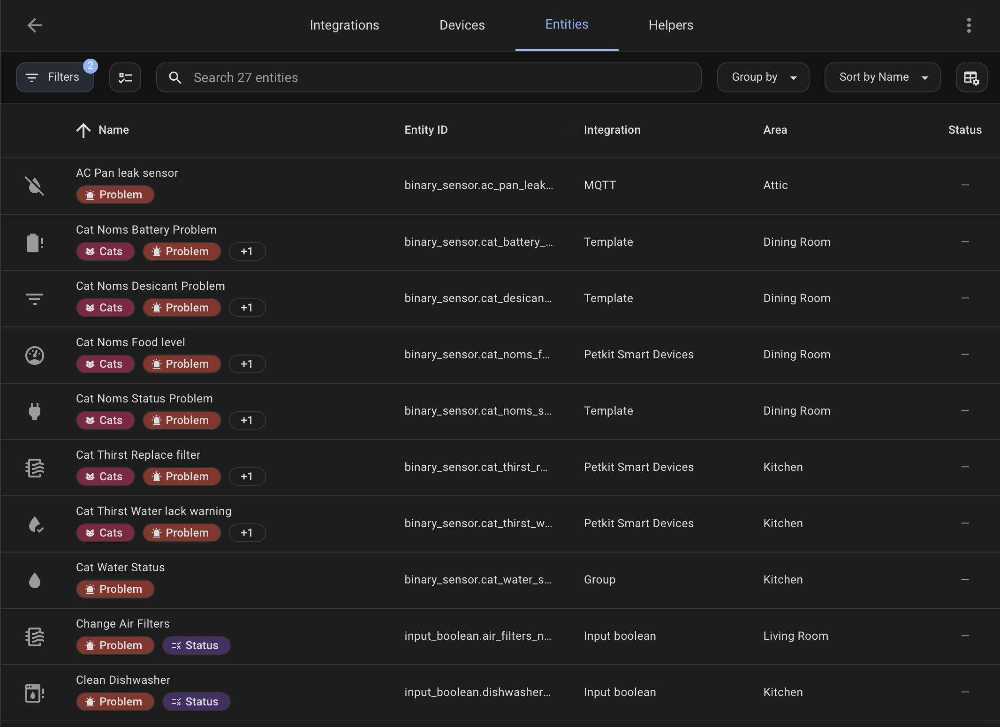

## Examples

### Basic Room

```yaml
type: custom:room-summary-card
area: living_room
```

### Custom Area Name

```yaml
type: custom:room-summary-card
area: living_room
area_name: 'Family Room'
```

### With Background Image

```yaml
type: custom:room-summary-card
area: living_room
background:
  image: /local/images/living-room.jpg
  opacity: 30
```

### With Dynamic Background

```yaml
type: custom:room-summary-card
area: bedroom
background:
  image_entity: person.john
  opacity: 40
```

### With Custom Entity

```yaml
type: custom:room-summary-card
area: living_room
entity:
  entity_id: light.living_room_main
  icon: mdi:ceiling-light
  tap_action:
    action: toggle
```

### Multiple Sensors with Bottom Layout

```yaml
type: custom:room-summary-card
area: living_room
sensors:
  - sensor.living_room_temperature
  - sensor.living_room_humidity
  - sensor.living_room_co2
  - sensor.living_room_light_level
sensor_layout: bottom
```

### With Custom Thresholds

```yaml
type: custom:room-summary-card
area: garage
thresholds:
  temperature: 85 # Red border above 85°F
  humidity: 70 # Blue border above 70%
  mold: 50 # Animated mold indicator above 50%
```

### With Mold Detection

```yaml
type: custom:room-summary-card
area: basement
thresholds:
  mold: 45 # Shows animated mold warning when levels exceed 45%
  temperature: 65 # Lower temperature threshold for basement
  humidity: 60
```

### Exclude Default Entities

```yaml
type: custom:room-summary-card
area: office
features:
  - exclude_default_entities
entities:
  - entity_id: light.office_desk
    icon: mdi:desk-lamp
  - entity_id: switch.office_computer
    icon: mdi:desktop-tower
```

### Hide Room Icon

```yaml
type: custom:room-summary-card
area: bathroom
features:
  - hide_room_icon
background:
  image: /local/images/bathroom.jpg
  opacity: 35
```

### Occupancy Detection

```yaml
type: custom:room-summary-card
area: living_room
occupancy:
  entities:
    - binary_sensor.living_room_motion
    - binary_sensor.living_room_occupancy
  card_border_color: '#4CAF50' # Green border when occupied
  icon_color: '#FF9800' # Orange icon background when occupied
```

### Advanced Occupancy with Multiple Sensors

```yaml
type: custom:room-summary-card
area: master_bedroom
occupancy:
  entities:
    - binary_sensor.master_bedroom_motion
    - binary_sensor.master_bedroom_presence
    - device_tracker.phone_john
    - device_tracker.phone_jane
  card_border_color: '#E91E63' # Pink border
  icon_color: '#9C27B0' # Purple icon background
background:
  image: /local/images/bedroom.jpg
  opacity: 25
```

### Occupancy with Custom Styling

```yaml
type: custom:room-summary-card
area: home_office
occupancy:
  entities:
    - binary_sensor.office_motion
    - binary_sensor.office_occupancy
  card_border_color: '#2196F3' # Blue border
  icon_color: '#03A9F4' # Light blue icon
styles:
  card:
    border-radius: 12px
    transition: all 0.3s ease
  title:
    font-weight: 600
    color: '#1976D2'
```

### Occupancy with Minimal Effects

```yaml
type: custom:room-summary-card
area: bathroom
occupancy:
  entities:
    - binary_sensor.bathroom_motion
  options:
    - disabled_card_styles # Disable border changes
    - disabled_card_styles_animation # Disable border animation
  icon_color: '#FF5722' # Only change icon color
```

### Full Configuration Example

```yaml
type: custom:room-summary-card
area: living_room
area_name: 'Living Room'
entity:
  entity_id: light.living_room_main
  icon: mdi:ceiling-light
  tap_action:
    action: toggle
  hold_action:
    action: more-info
entities:
  - entity_id: switch.living_room_tv
    icon: mdi:television
  - light.living_room_lamp
  - switch.living_room_fan
sensors:
  - sensor.living_room_temperature
  - sensor.living_room_humidity
  - sensor.living_room_co2
sensor_layout: bottom
background:
  image: /local/images/living-room.jpg
  opacity: 25
occupancy:
  entities:
    - binary_sensor.living_room_motion
    - binary_sensor.living_room_occupancy
  card_border_color: '#4CAF50'
  icon_color: '#8BC34A'
thresholds:
  temperature: 75
  humidity: 55
  mold: 50
  temperature_entity: sensor.specific_temp_sensor
  humidity_entity: sensor.specific_humidity_sensor
navigate: /lovelace/living-room
features:
  - hide_area_stats
  - hide_sensor_icons
```

### Minimal Sensor Display (Icons Only)

```yaml
type: custom:room-summary-card
area: living_room
features:
  - hide_sensor_labels
sensor_layout: bottom
sensors:
  - sensor.living_room_temperature
  - sensor.living_room_humidity
  - sensor.living_room_co2
```

This configuration shows only sensor icons without text labels, creating a minimal and clean appearance.

### Entity Labels with Clean Icons

```yaml
type: custom:room-summary-card
area: living_room
features:
  - show_entity_labels
styles:
  entity_icon:
    '--opacity-icon-fill-inactive': 0
    '--opacity-icon-fill-active': 0
```

This configuration shows entity labels under each icon while hiding the icon backgrounds for a cleaner look.

### Entity Labels with Custom Styling

```yaml
type: custom:room-summary-card
area: office
features:
  - show_entity_labels
entities:
  - entity_id: light.office_desk
    icon: mdi:desk-lamp
  - entity_id: switch.office_computer
    icon: mdi:desktop-tower
  - entity_id: climate.office_hvac
    icon: mdi:air-conditioner
styles:
  entity_icon:
    '--opacity-icon-fill-inactive': 0.3
    '--opacity-icon-fill-active': 0.8
    filter: 'drop-shadow(1px 1px 2px rgba(0,0,0,0.2))'
```

This example shows entity labels with custom icon styling and opacity levels.

### Problem Entities Setup

To use problem detection, label entities with "problem":

1. In Home Assistant, go to Settings → Areas & Labels
2. Create or edit labels
3. Add "problem" label to relevant entities
4. The card will automatically detect and count them



### Climate Thresholds

For climate-based border styling:

- Temperature sensors with `device_class: temperature` and values above threshold trigger red borders
- Humidity sensors with `device_class: humidity` and values above threshold trigger blue borders
- Configure thresholds in the card configuration:

```yaml
type: custom:room-summary-card
area: living_room
thresholds:
  temperature: 75 # Custom temperature threshold
  humidity: 55 # Custom humidity threshold
```

## Custom Styling Examples

### Basic Custom Colors

```yaml
type: custom:room-summary-card
area: living_room
styles:
  title:
    color: '#4CAF50'
    font-weight: bold
  entities:
    background: blue
  stats:
    color: '#FFC107'
  sensors:
    color: '#2196F3'
```

### Modern Glass Card

```yaml
type: custom:room-summary-card
area: bedroom
styles:
  card:
    background: 'rgba(255, 255, 255, 0.1)'
    border: '1px solid rgba(255, 255, 255, 0.2)'
    border-radius: 20px
    backdrop-filter: 'blur(10px)'
  title:
    color: '#ffffff'
    font-weight: 300
    letter-spacing: 2px
  stats:
    color: 'rgba(255, 255, 255, 0.7)'
  sensors:
    color: 'rgba(255, 255, 255, 0.8)'
```

## Multi-Light Background Examples

### Basic Multi-Light Setup

```yaml
type: custom:room-summary-card
area: kitchen
features:
  - multi_light_background
```

This automatically tracks all light entities in the kitchen area and shows a lit background when any are on.

### Kitchen with Multiple Light Types

```yaml
type: custom:room-summary-card
area: kitchen
features:
  - multi_light_background
lights:
  - light.kitchen_main
  - light.kitchen_under_cabinet
  - light.kitchen_island
  - switch.kitchen_pendant
```

### Bedroom with Mixed Entities

```yaml
type: custom:room-summary-card
area: bedroom
features:
  - multi_light_background
lights:
  - light.bedroom_ceiling
  - light.bedroom_bedside_left
  - light.bedroom_bedside_right
  - switch.bedroom_accent_lighting
background:
  image: /local/images/bedroom.jpg
  opacity: 25
```

### Living Room with Background Image

```yaml
type: custom:room-summary-card
area: living_room
features:
  - multi_light_background
lights:
  - light.living_room_main
  - light.living_room_lamp
  - light.living_room_accent
background:
  image: /local/images/living-room.jpg
  opacity: 30
occupancy:
  entities:
    - binary_sensor.living_room_motion
  card_border_color: '#4CAF50'
```

### Office with Auto-Discovery

```yaml
type: custom:room-summary-card
area: office
features:
  - multi_light_background
  - hide_area_stats
entity:
  entity_id: light.office_main
  icon: mdi:ceiling-light
entities:
  - switch.office_computer
  - light.office_desk_lamp
```

This example uses automatic light discovery while still displaying specific entities in the card.
