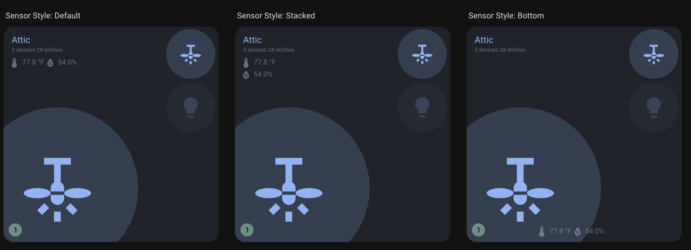

## Sensor Configuration

The card supports two types of sensor display:

### Individual Sensors (`sensors`)

Display specific sensor entities in your preferred order:

```yaml
sensors:
  - sensor.living_room_temperature_main # Specific sensor
  - sensor.living_room_humidity_main # Specific sensor
  - sensor.living_room_co2 # Additional sensor
```

### Averaged Sensors (`sensor_classes`)

Display averaged readings for device classes across the area:

```yaml
sensor_classes:
  - temperature # Average of all temperature sensors
  - humidity # Average of all humidity sensors
  - pressure # Average of all pressure sensors
```

### Combined Configuration

You can use both together - individual sensors display first, then averages:

```yaml
sensors:
  - sensor.living_room_co2 # Shown first
sensor_classes:
  - temperature # Averaged, shown after individual
  - humidity # Averaged, shown after individual
```

### How It Works

The card automatically:

1. Finds all sensors in the area with the specified device classes
2. Groups them by unit of measurement (°F, °C, %, etc.)
3. Calculates averages for each group
4. Displays the averaged values

### Default Behavior

```yaml
# Default configuration (automatic)
sensor_classes:
  - temperature
  - humidity
  - illuminance
```

### Custom Device Classes

```yaml
# Custom sensor classes
sensor_classes:
  - temperature
  - humidity
  - pressure
  - illuminance
  - co2
```

**Reference**: This uses similar logic as [Home Assistant's area card](https://www.home-assistant.io/dashboards/area).

### Display Priority

Sensors are displayed in this order:

1. **Individual sensors** (from `sensors` config) - in specified order
2. **Averaged sensors** (from `sensor_classes`) - grouped by device class

### Relationship with Individual Sensors

- If using `sensor_classes`, you don't need to manually include those entities in `sensors`
- Individual sensors in `sensors` will always display first
- Averaged sensors appear after individual sensors

### Sensor Layout Options

- **`default`**: Displays sensors in the label area alongside room statistics
- **`stacked`**: Displays sensors vertically stacked in the label area
- **`bottom`**: Displays sensors at the bottom of the card for maximum visibility



### Legacy Sensor Configuration (Deprecated)

For backward compatibility, you can still use:

```yaml
temperature_sensor: sensor.living_room_temperature
humidity_sensor: sensor.living_room_humidity
```

> **Note:** Please migrate to the `sensors` array as these legacy properties will be removed in a future version.
