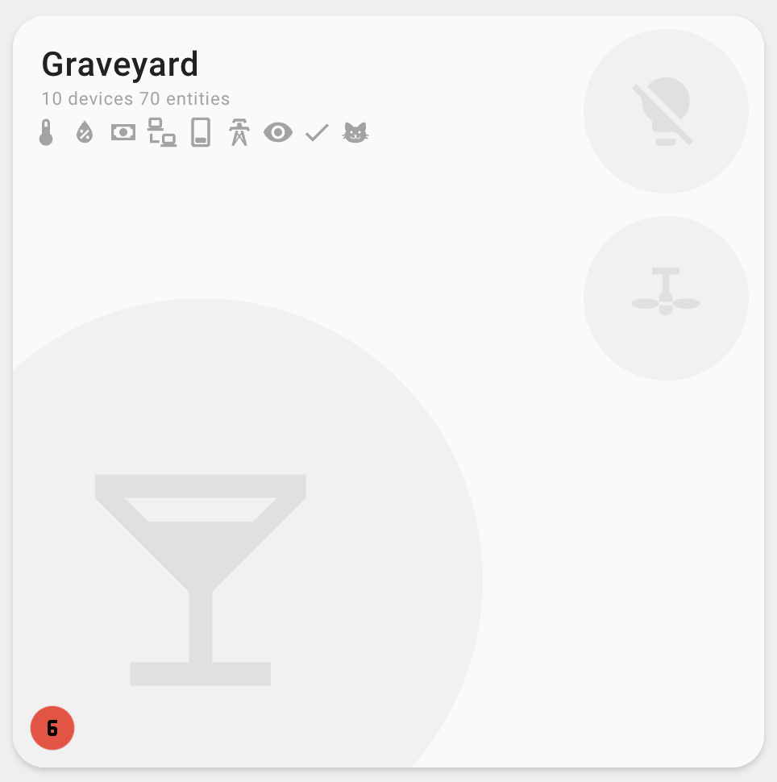

## Sensor Configuration

The card supports two types of sensor display:

### Individual Sensors (`sensors`)

Display specific sensor entities in your preferred order. Sensors can be specified in two ways:

#### Simple String Format

```yaml
sensors:
  - sensor.living_room_temperature_main # Specific sensor
  - sensor.living_room_humidity_main # Specific sensor
  - sensor.living_room_co2 # Additional sensor
```

#### Object Format

```yaml
sensors:
  - entity_id: sensor.living_room_temperature_main
  - entity_id: sensor.living_room_humidity_main
  - entity_id: sensor.living_room_co2
```

#### Mixed Format

You can mix both formats in the same configuration:

```yaml
sensors:
  - sensor.living_room_temperature_main # String format
  - entity_id: sensor.living_room_humidity_main # Object format
  - sensor.living_room_co2 # String format
```

### Averaged Sensors (`sensor_classes`)

Display averaged readings for device classes across the area:

```yaml
sensor_classes:
  - temperature # Average of all temperature sensors
  - humidity # Average of all humidity sensors
  - pressure # Average of all pressure sensors
```

### Combined Configuration

You can use both together - individual sensors display first, then averages:

```yaml
sensors:
  - sensor.living_room_co2 # Shown first
  - entity_id: sensor.living_room_pressure # Object format also supported
sensor_classes:
  - temperature # Averaged, shown after individual
  - humidity # Averaged, shown after individual
```

### How It Works

The card automatically:

1. Finds all sensors in the area with the specified device classes
2. Groups them by unit of measurement (°F, °C, %, etc.)
3. Calculates averages for each group
4. Displays the averaged values

### Default Behavior

```yaml
# Default configuration (automatic)
sensor_classes:
  - temperature
  - humidity
  - illuminance
```

### Custom Device Classes

```yaml
# Custom sensor classes
sensor_classes:
  - temperature
  - humidity
  - pressure
  - illuminance
  - co2
```

**Reference**: This uses similar logic as [Home Assistant's area card](https://www.home-assistant.io/dashboards/area).

### Display Priority

Sensors are displayed in this order:

1. **Individual sensors** (from `sensors` config) - in specified order
2. **Averaged sensors** (from `sensor_classes`) - grouped by device class

### Relationship with Individual Sensors

- If using `sensor_classes`, you don't need to manually include those entities in `sensors`
- Individual sensors in `sensors` will always display first
- Averaged sensors appear after individual sensors

### Sensor Layout Options

- **`default`**: Displays sensors in the label area alongside room statistics
- **`stacked`**: Displays sensors vertically stacked in the label area
- **`bottom`**: Displays sensors at the bottom of the card for maximum visibility


### Interactive Sensors

Sensors in the info section now support interactive behavior:

#### Clickable Individual Sensors

Individual sensors (configured via `sensors`) are clickable and will open the Home Assistant "more info" dialog when tapped:

```yaml
sensors:
  - sensor.living_room_temperature # Clickable - opens more info dialog
  - sensor.living_room_humidity # Clickable - opens more info dialog
```

This allows you to quickly access detailed sensor information, history, and controls directly from the card.

#### Non-Interactive Averaged Sensors

Averaged sensors (from `sensor_classes`) are **not clickable** as they represent calculated values from multiple sensors:

```yaml
sensor_classes:
  - temperature # Not clickable - calculated average
  - humidity # Not clickable - calculated average
```

This design choice prevents confusion since averaged sensors don't represent a single entity that can be interacted with.

### Sensor Display Options

You can customize how sensor information is displayed using feature flags:

#### Hide Sensor Icons

Hide the icons next to sensor values while keeping the text labels:

```yaml
features:
  - hide_sensor_icons
sensors:
  - sensor.living_room_temperature # Shows: "72°F" (no icon)
```

#### Hide Sensor Labels

Hide the text labels next to sensor icons (opposite of `hide_sensor_icons`):

```yaml
features:
  - hide_sensor_labels
sensors:
  - sensor.living_room_temperature # Shows: 🌡️ (icon only, no text)
```

#### Icons Only Display

For a minimal icon-only display:

```yaml
features:
  - hide_sensor_labels
sensor_layout: bottom
sensors:
  - sensor.living_room_temperature
  - sensor.living_room_humidity
```

This is useful for compact layouts where you want visual indicators without text.



### Legacy Sensor Configuration (Deprecated)

For backward compatibility, you can still use:

```yaml
temperature_sensor: sensor.living_room_temperature
humidity_sensor: sensor.living_room_humidity
```

> **Note:** Please migrate to the `sensors` array as these legacy properties will be removed in a future version.
