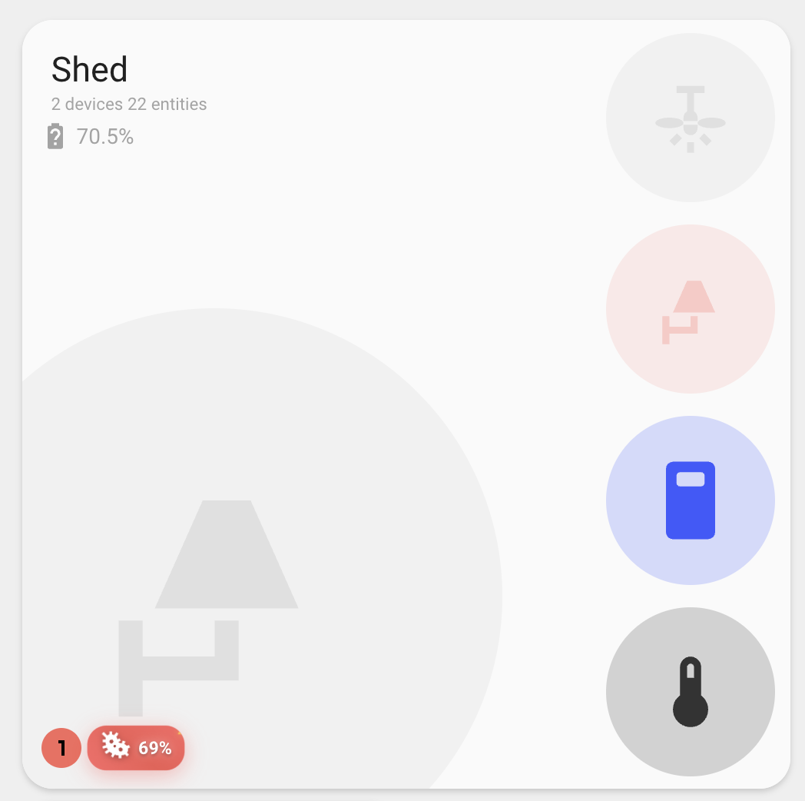
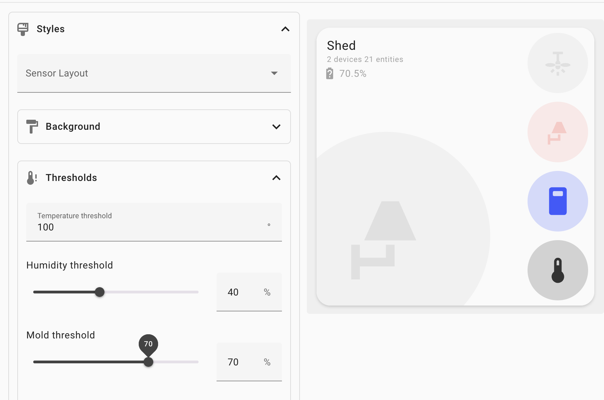

## Climate Threshold Configuration

Configure climate-based border styling thresholds and mold detection:


> **Note:** This covers **climate thresholds** for card styling. For **entity threshold colors** based on individual sensor values, see [Entity Color Configuration](ENTITY-COLOR-CONFIGURATION.md#3-threshold-based-colors).

```yaml
thresholds:
  temperature: 75 # Temperature threshold in current unit or entity
  humidity: 55 # Humidity threshold as percentage or entity
  mold: 50 # Mold threshold as percentage
  temperature_operator: gt # Comparison operator for temperature (default: gt)
  humidity_operator: gt # Comparison operator for humidity (default: gt)
```

**How It Works**:

- **Temperature sensors** with values meeting the threshold condition trigger red borders
- **Humidity sensors** with values meeting the threshold condition trigger blue borders
- **Mold sensors** with values at or above the threshold display an animated indicator near problem entities (bottom left)
- Thresholds respect the current unit of measurement (°F, °C, %)
- Can be disabled with the `skip_climate_styles` feature flag
- For advanced cases an entity can be configured as the one to trip the threshold.

### Comparison Operators

You can specify how the sensor values are compared to the threshold using comparison operators:

- **`gt`** (Greater than): `value > threshold` - Default for both temperature and humidity
- **`gte`** (Greater than or equal): `value >= threshold`
- **`lt`** (Less than): `value < threshold` - Useful for heating scenarios
- **`lte`** (Less than or equal): `value <= threshold`
- **`eq`** (Equal): `value === threshold` - Exact match

**Use Cases**:

- **Cooling scenarios** (default): Use `gt` to detect when temperature is above threshold
- **Heating scenarios**: Use `lt` to detect when temperature is below threshold
- **Medical conditions**: Use `lt` for humidity to detect when it's too low
- **Exact monitoring**: Use `eq` to detect specific values

### Mold Indicator

The mold indicator provides a prominent visual warning when mold levels exceed your configured threshold:

- **Location**: Appears in the bottom left area near problem entities
- **Visual Design**: Animated red gradient background with pulsing effects
- **Components**: Shows the mold sensor icon and current value
- **Animations**: Includes pulsing, bouncing, and glowing effects to draw attention
- **Warning Symbol**: Displays a flashing warning triangle (⚠) for additional emphasis
- **Hover Effects**: Scales up and intensifies animations on hover



**Mold Sensor Requirements**:

- Must be a sensor entity with a numeric state value
- Should represent mold level as a percentage (0-100)
- Will only display when the sensor value is at or above the configured threshold
- If no threshold is configured, the indicator will always show when a mold sensor is present



**Examples**:

```yaml
# Celsius threshold
thresholds:
  temperature: 24  # 24°C

# Fahrenheit threshold
thresholds:
  temperature: 75  # 75°F

# Custom humidity threshold
thresholds:
  humidity: 50  # 50%

# Entity thresholds
thresholds:
  temperature: sensor.main_temperature # Specific entity for temperature value from entity
  humidity: sensor.main_humidity # Specific entity for humidity value from entity

# Mold threshold
thresholds:
  mold: 45  # 45% mold level

# All thresholds together
thresholds:
  temperature: 78
  humidity: 65
  mold: 50

# specific entities trigger the threshold, not average
# this is not needed in most scenarios
thresholds:
  temperature: 75
  humidity: 55
  mold: 50
  temperature_entity: sensor.living_room_temperature # Specific entity for temperature threshold
  humidity_entity: sensor.living_room_humidity # Specific entity for humidity threshold

# Heating scenario - detect when temperature is below threshold
thresholds:
  temperature: 68
  temperature_operator: lt # Trigger when temperature < 68°F

# Medical condition - detect when humidity is too low
thresholds:
  humidity: 30
  humidity_operator: lt # Trigger when humidity < 30%

# Combined heating and low humidity detection
thresholds:
  temperature: 70
  humidity: 35
  temperature_operator: lt # Below 70°F
  humidity_operator: lt # Below 35%

# Exact temperature monitoring
thresholds:
  temperature: 72
  temperature_operator: eq # Trigger only when exactly 72°F
```

**Default values**: 80°F (26.7°C) for temperature, 60% for humidity, no default for mold (indicator shows whenever mold sensor is present)
